# Training plan 

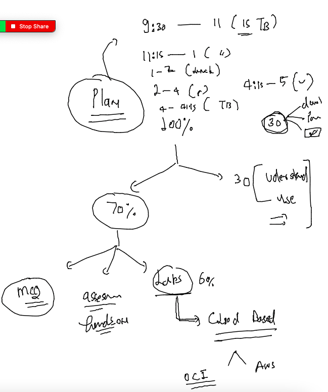

## Docker Revision 

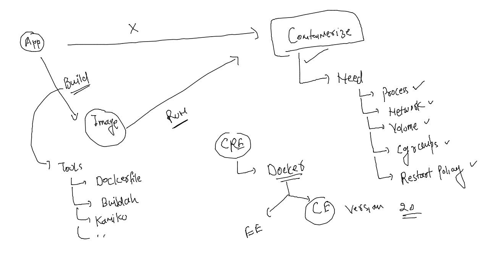

### docker volume mounting concept 

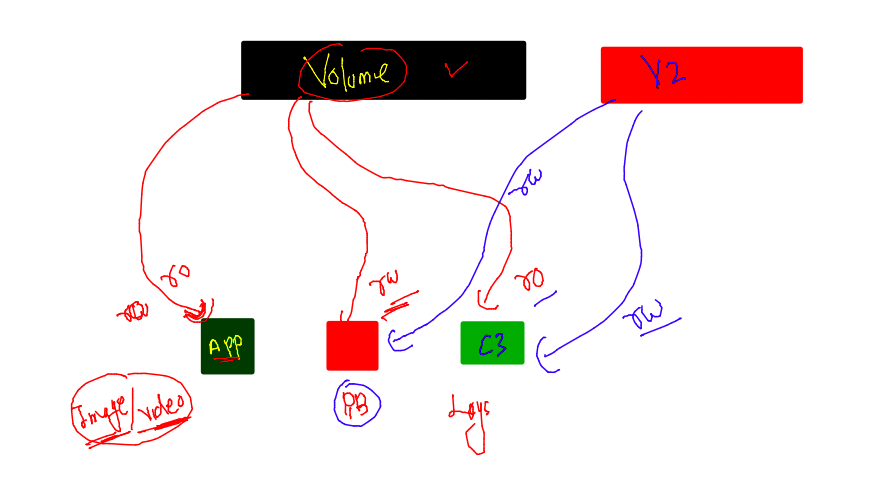

### creating db container with volume 

```
254  docker run -d --name ashudbc1 -e MYSQL_ROOT_PASSWORD="Oracle@098#"  -v ashu-vol:/var/lib/mysql/:rw  mysql:latest 
  255  docker  ps
  256  history 
  257  docker ps
  258  docker logs ashudbc1
  259  history 
[ashu@docker-ce ashu-images]$ 
[ashu@docker-ce ashu-images]$ docker exec -it ashudbc1 bash 
bash-4.4# 
bash-4.4# mysql -u root -p
Enter password: 
Welcome to the MySQL monitor.  Commands end with ; or \g.
Your MySQL connection id is 8
Server version: 8.0.31 MySQL Community Server - GPL

Copyright (c) 2000, 2022, Oracle and/or its affiliates.

Oracle is a registered trademark of Oracle Corporation and/or its
affiliates. Other names may be trademarks of their respective
owners.

Type 'help;' or '\h' for help. Type '\c' to clear the current input statement.

mysql> show databases;
+--------------------+
| Database           |
+--------------------+
| information_schema |
| mysql              |
| performance_schema |
| sys                |
+--------------------+
4 rows in set (0.00 sec)

mysql> create  database hellodb;
Query OK, 1 row affected (0.00 sec)

mysql> show databases;
+--------------------+
| Database           |
+--------------------+
| hellodb            |
| information_schema |
| mysql              |
| performance_schema |
| sys                |
+--------------------+
5 rows in set (0.00 sec)

mysql> ^DBye
bash-4.4# exit
[ashu@docker-ce ashu-images]$ 
```

### destroy container 

```
[ashu@docker-ce ashu-images]$ docker rm ashudbc1 -f
ashudbc1
[ashu@docker-ce ashu-images]$ docker ps 
CONTAINER ID   IMAGE     COMMAND   CREATED   STATUS    PORTS     NAMES
[ashu@docker-ce ashu-images]$ docker run -d --name ashudbc1 -e MYSQL_ROOT_PASSWORD="Oracle@098#"  -v ashu-vol:/var/lib/mysql/:rw  mysql:latest 
ccaa529ca7f88ea55f608d66c264f67d6d01931b0c7740952e0f85c4616f967c
[ashu@docker-ce ashu-images]$ 
[ashu@docker-ce ashu-images]$ docker exec -it ashudbc1 bash 
bash-4.4# 
bash-4.4# mysql -u root -p
Enter password: 
Welcome to the MySQL monitor.  Commands end with ; or \g.
Your MySQL connection id is 8
Server version: 8.0.31 MySQL Community Server - GPL

Copyright (c) 2000, 2022, Oracle and/or its affiliates.

Oracle is a registered trademark of Oracle Corporation and/or its
affiliates. Other names may be trademarks of their respective
owners.

Type 'help;' or '\h' for help. Type '\c' to clear the current input statement.

mysql> show databases;
+--------------------+
| Database           |
+--------------------+
| hellodb            |
| information_schema |
| mysql              |
| performance_schema |
| sys                |
+--------------------+
5 rows in set (0.01 sec)

mysql> ^DBye
bash-4.4# exit
```

### two volume in same container 

```
ashu@docker-ce ashu-images]$ docker  run -it --name ashuc2 -v ashu-vol:/mnt/data:ro  -v  ashuvol9:/opt/data:rw   oraclelinux:8.4 
[root@141ebad13b0c /]# 
[root@141ebad13b0c /]# cp -rfv /mnt/data/*  /opt/data/
'/mnt/data/#ib_16384_0.dblwr' -> '/opt/data/#ib_16384_0.dblwr'
'/mnt/data/#ib_16384_1.dblwr' -> '/opt/data/#ib_16384_1.dblwr'
'/mnt/data/#innodb_redo' -> '/opt/data/#innodb_redo'
'/mnt/data/#innodb_redo/#ib_redo10_tmp' -> '/opt/data/#innodb_redo/#ib_redo10_tmp'
'/mnt/data/#innodb_redo/#ib_redo11_tmp' -> '/opt/data/#innodb_redo/#ib_redo11_tmp'
'/mnt/data/#innodb_redo/#ib_redo12_
```

### bind mount 

```
ashu@docker-ce ashu-images]$ git clone https://github.com/yenchiah/project-website-template.git
Cloning into 'project-website-template'...
remote: Enumerating objects: 1025, done.
remote: Total 1025 (delta 0), reused 0 (delta 0), pack-reused 1025
Receiving objects: 100% (1025/1025), 1.64 MiB | 7.23 MiB/s, done.
Resolving deltas: 100% (632/632), done.
[ashu@docker-ce ashu-images]$ ls
html-sample-app  java-app  javawebapp  project-website-template  python-apps
[ashu@docker-ce ashu-images]$ 
[ashu@docker-ce ashu-images]$ pwd
/home/ashu/ashu-images
[ashu@docker-ce ashu-images]$ docker run -d --name ashuwebc1 -v  /home/ashu/ashu-images/project-website-template/:/usr/share/nginx/html:ro -p 1234:80 nginx 
08b98c82acc413d49dc0ff3daa972094f5f47da66a245eebd9038f7e43f438b3
[ashu@docker-ce ashu-images]$ 
[ashu@docker-ce ashu-images]$ 
[ashu@docker-ce ashu-images]$ 

```

## managing app containers using compose 

```
[root@docker-ce ~]# curl -SL https://github.com/docker/compose/releases/download/v2.13.0/docker-compose-linux-x86_64 -o /usr/local/bin/docker-compose
  % Total    % Received % Xferd  Average Speed   Time    Time     Time  Current
                                 Dload  Upload   Total   Spent    Left  Speed
  0     0    0     0    0     0      0      0 --:--:-- --:--:-- --:--:--     0
100 43.5M  100 43.5M    0     0  12.2M      0  0:00:03  0:00:03 --:--:-- 15.6M
[root@docker-ce ~]# cp -v /usr/local/bin/docker-compose  /usr/bin/
'/usr/local/bin/docker-compose' -> '/usr/bin/docker-compose'
[root@docker-ce ~]# chmod +x /usr/bin/docker-compose 
[root@docker-ce ~]# 
[root@docker-ce ~]# docker-compose version 
Docker Compose version v2.13.0
[root@docker-ce ~]# 


```

### info about compose file 

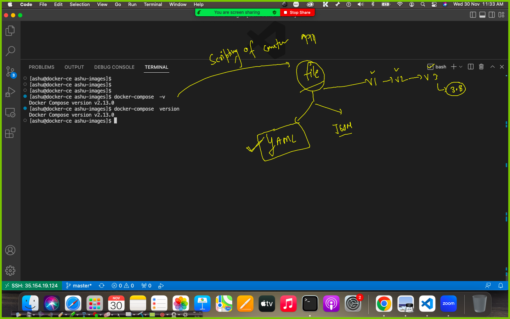

## COmpsoe file examples 

### example 1 

```

version: '3.8'
services: # here we write app component details
  ashuwebapp: # name of app component -- you can give any name 
    image: nginx 
    container_name: ashungc1
    ports:
    - "1234:80"
    volumes:
    - "../html-sample-app:/usr/share/nginx/html/"
    restart: always 
```

### lets run it 

```
ashu@docker-ce ashu-images]$ ls
ashu-compose  html-sample-app  java-app  javawebapp  project-website-template  python-apps
[ashu@docker-ce ashu-images]$ cd  ashu-compose/
[ashu@docker-ce ashu-compose]$ ls
docker-compose.yaml
[ashu@docker-ce ashu-compose]$ docker-compose up -d
[+] Running 2/2
 ⠿ Network ashu-compose_default  Created                                                                                         0.0s
 ⠿ Container ashungc1            Started                                                                                         0.5s
[ashu@docker-ce ashu-compose]$ docker-compose  ps
NAME                COMMAND                  SERVICE             STATUS              PORTS
ashungc1            "/docker-entrypoint.…"   ashuwebapp          running             0.0.0.0:1234->80/tcp, :::1234->80/tcp
[ashu@docker-ce ashu-compose]$ 


```

### more operation example to compose 

```
[ashu@docker-ce ashu-compose]$ docker-compose  stop 
[+] Running 1/1
 ⠿ Container ashungc1  Stopped                                                                                                   0.2s
[ashu@docker-ce ashu-compose]$ docker-compose  ps
NAME                COMMAND                  SERVICE             STATUS              PORTS
ashungc1            "/docker-entrypoint.…"   ashuwebapp          exited (0)          
[ashu@docker-ce ashu-compose]$ docker-compose  start
[+] Running 1/1
 ⠿ Container ashungc1  Started                                                                                                   0.5s
[ashu@docker-ce ashu-compose]$ docker-compose  ps
NAME                COMMAND                  SERVICE             STATUS              PORTS
ashungc1            "/docker-entrypoint.…"   ashuwebapp          running             0.0.0.0:1234->80/tcp, :::1234->80/tcp
[ashu@docker-ce ashu-compose]$ 
```

### --

```
[ashu@docker-ce ashu-compose]$ docker-compose  ps
NAME                COMMAND                  SERVICE             STATUS              PORTS
ashungc1            "/docker-entrypoint.…"   ashuwebapp          running             0.0.0.0:1234->80/tcp, :::1234->80/tcp
[ashu@docker-ce ashu-compose]$ docker-compose  kill
[+] Running 1/1
 ⠿ Container ashungc1  Killed                                                                                                    0.2s
[ashu@docker-ce ashu-compose]$ docker-compose  start
[+] Running 1/1
 ⠿ Container ashungc1  Started                                                                                                   0.5s
[ashu@docker-ce ashu-compose]$ docker-compose  down 
[+] Running 2/2
 ⠿ Container ashungc1            Removed                                                                                         0.2s
 ⠿ Network ashu-compose_default  Removed    
```

### Example 2 -- docker compose file 

```
version: '3.8'
services: # here we write app component details
  ashujavaweb:
    image: ashujava:webv1 # want to build image 
    build: 
      context: ../javawebapp/ # location of dockerfile 
      dockerfile: Dockerfile  # name of dockerfile 
    container_name: ashujc1 
    ports:
    - "1299:8080"
  ashuwebapp: # name of app component -- you can give any name 
    image: nginx 
    container_name: ashungc1
    ports:
    - "1234:80"
    volumes:
    - "../html-sample-app:/usr/share/nginx/html/"
    restart: always 
   
```

### lets run it 

```
ashu@docker-ce ashu-compose]$ docker-compose up -d --build 
[+] Building 0.7s (9/10)                                                                                                              
 => [internal] load build definition from Dockerfile                                                                             0.0s
 => => transferring dockerfile: 146B                                                                                             0.0s
 => [internal] load .dockerignore                                                                                                0.0s
 => => transferring context: 2B                                                                                                  0.0s
 => [internal] load metadata for docker.io/library/tomcat:latest                                                                 0.0s
 => [internal] load build context                                                                                                0.1s
 => => transferring context: 39.71kB                                                                                             0.0s
 => [1/5] FROM docker.io/library/tomcat                                                                                          0.7s
 => [2/5] WORKDIR /usr/local/tomcat/webapps                                                                                      0.0s
 => [3/5] RUN mkdir ashu                                                                                                         0.4s
 => [4/5] WORKDIR ashu                                                                                                           0.0s
 => [5/5] ADD myapp .                                                                                                            0.0s
 => exporting to image                                                                                                           0.1s
 => => exporting layers                                                                                                          0.0s
 => => writing image sha256:f2ee2e42587c8749ec009f004d9a8bffe3c662ff2de4adcefdae3b122edea250                                     0.0s
 => => naming to docker.io/library/ashujava:webv1                                                                                0.0s
[+] Running 3/3
 ⠿ Network ashu-compose_default  Created                                                                                         0.0s
 ⠿ Container ashungc1            Started                                                                                         0.9s
 ⠿ Container ashujc1             Started                                                                                         0.9s
[ashu@docker-ce ashu-compose]$ docker-compose ps
NAME                COMMAND                  SERVICE             STATUS              PORTS
ashujc1             "catalina.sh run"        ashujavaweb         running             0.0.0.0:1299->8080/tcp, :::1299->8080/tcp
ashungc1            "/docker-entrypoint.…"   ashuwebapp          running             0.0.0.0:1234->80/tcp, :::1234->80/tcp
[ashu@docker-ce ashu-compose]$ 
```

### 

```
ashu@docker-ce ashu-compose]$ docker-compose down 
[+] Running 3/3
 ⠿ Container ashungc1            Removed                                                                                        10.2s
 ⠿ Container ashujc1             Removed                                                                                         0.2s
 ⠿ Network ashu-compose_default  Removed        
```

### Example 3  --

```
version: '3.8'
volumes: # to create volume 
  ashuvol009: # name of volume 
services:
  ashutestapp: 
    image: alpine 
    container_name: ashuc111
    volumes: # attaching volume 
    - "ashuvol009:/mnt/data/"
    command: ping -i 5 www.google.com >/mnt/data/logs.txt  # script inside container 
    restart: always 
```

### running a non docker-compose.yaml file 

```
[ashu@docker-ce ashu-compose]$ docker-compose -f test.yaml  up -d
[+] Running 3/3
 ⠿ Network ashu-compose_default      Created                                                                                     0.0s
 ⠿ Volume "ashu-compose_ashuvol009"  Created                                                                                     0.0s
 ⠿ Container ashuc111                Started                                                                                     0.5s
[ashu@docker-ce ashu-compose]$ docker-compose -f test.yaml  ps
NAME                COMMAND                  SERVICE             STATUS              PORTS
ashuc111            "ping -i 5 www.googl…"   ashutestapp         running             
[ashu@docker-ce ashu-compose]$ docker-compose -f test.yaml  exec  ashutestapp  sh 
/ # ls /mnt/data/
/ # ls
bin    dev    etc    home   lib    media  mnt    opt    proc   root   run    sbin   srv    sys    tmp    usr    var
/ # exit
[ashu@docker-ce ashu-compose]$ docker-compose -f test.yaml  down 
[+] Running 0/1
 ⠧ Container ashuc111  Stopping                                                                                                  8.8s


```

### final compose example 

```
version: '3.8'
volumes:
  ashudb-vol:
services:
  ashu-ui:
    image: adminer
    container_name: ashu-uic1
    ports:
    - "1234:8080"
    depends_on:
    - ashudbsvc 
  ashudbsvc:
    image: mysql
    container_name: ashudbc1
    environment:
      MYSQL_ROOT_PASSWORD: "Oracle@098#"
    volumes:
    - "ashudb-vol:/var/lib/mysql"
    restart: always 
```

## Problem with containers management 

### introduction to COntainer orchestration engine -- 

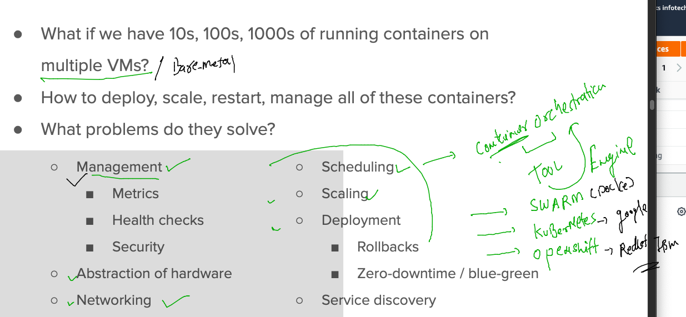


### Introduction to k8s 

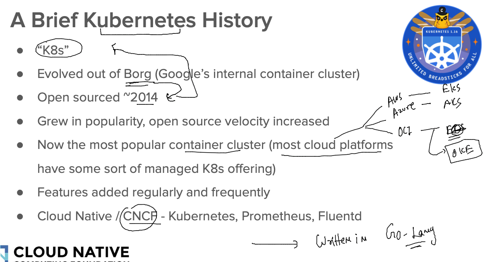

### k8s High level / upper level architecture 

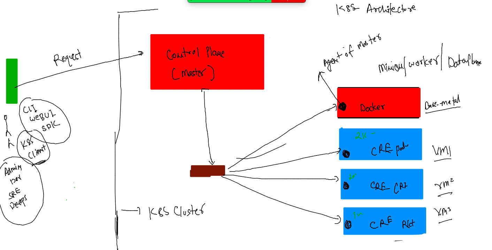

## Control plane components 

### kube-apiServer 

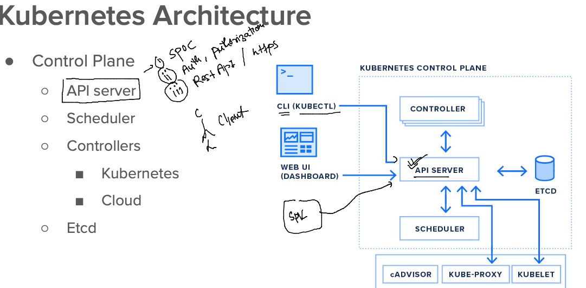

### Etcd -- the Nosql DB 

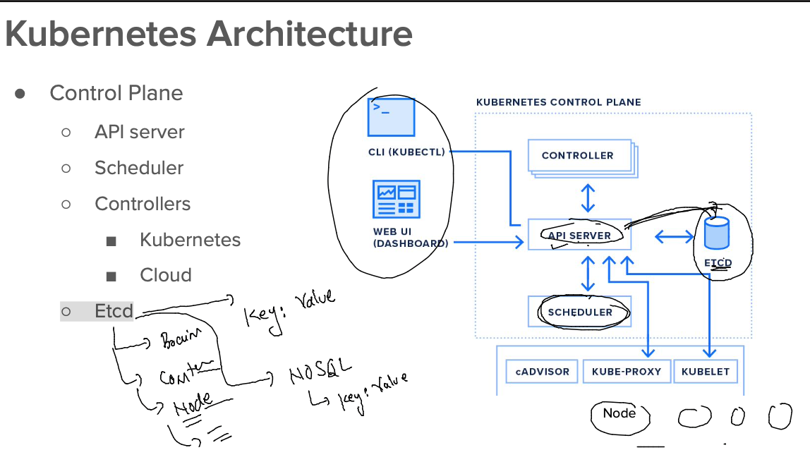

## WOrker Node COmponents 

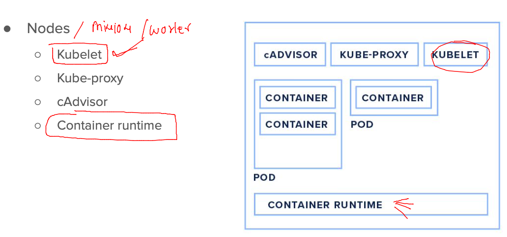

## K8s Client machine setup 

### installing kubectl on Linux machine 

```
[root@docker-ce ~]# curl -LO "https://dl.k8s.io/release/$(curl -L -s https://dl.k8s.io/release/stable.txt)/bin/linux/amd64/kubectl"
  % Total    % Received % Xferd  Average Speed   Time    Time     Time  Current
                                 Dload  Upload   Total   Spent    Left  Speed
100   138  100   138    0     0    500      0 --:--:-- --:--:-- --:--:--   500
100 42.9M  100 42.9M    0     0  55.0M      0 --:--:-- --:--:-- --:--:-- 55.0M
[root@docker-ce ~]# ls
kubectl
[root@docker-ce ~]# mv kubectl  /usr/bin/
[root@docker-ce ~]# chmod  +x /usr/bin/kubectl 
[root@docker-ce ~]# 
[root@docker-ce ~]# 
[root@docker-ce ~]# kubectl  version --client 
WARNING: This version information is deprecated and will be replaced with the output from kubectl version --short.  Use --output=yaml|json to get the full version.
Client Version: version.Info{Major:"1", Minor:"25", GitVersion:"v1.25.4", GitCommit:"872a965c6c6526caa949f0c6ac028ef7aff3fb78", GitTreeState:"clean", BuildDate:"2022-11-09T13:36:36Z", GoVersion:"go1.19.3", Compiler:"gc", Platform:"linux/amd64"}
Kustomize Version: v4.5.7
[root@docker-ce ~]# kubectl  version --client -o yaml 
clientVersion:
  buildDate: "2022-11-09T13:36:36Z"
  compiler: gc
  gitCommit: 872a965c6c6526caa949f0c6ac028ef7aff3fb78
  gitTreeState: clean
  gitVersion: v1.25.4
  goVersion: go1.19.3
  major: "1"
  minor: "25"
  platform: linux/amd64
kustomizeVersion: v4.5.7


```

### OR 

```
[ashu@docker-ce ashu-images]$ kubectl version --client -o yaml 
clientVersion:
  buildDate: "2022-11-09T13:36:36Z"
  compiler: gc
  gitCommit: 872a965c6c6526caa949f0c6ac028ef7aff3fb78
  gitTreeState: clean
  gitVersion: v1.25.4
  goVersion: go1.19.3
  major: "1"
  minor: "25"
  platform: linux/amd64
kustomizeVersion: v4.5.7

[ashu@docker-ce ashu-images]$ kubectl version --client -o json 
{
  "clientVersion": {
    "major": "1",
    "minor": "25",
    "gitVersion": "v1.25.4",
    "gitCommit": "872a965c6c6526caa949f0c6ac028ef7aff3fb78",
    "gitTreeState": "clean",
    "buildDate": "2022-11-09T13:36:36Z",
    "goVersion": "go1.19.3",
    "compiler": "gc",
    "platform": "linux/amd64"
  },
  "kustomizeVersion": "v4.5.7"
}
```

### Install kubectl on MAC 

```
fire@ashutoshhs-MacBook-Air ~ % curl -LO "https://dl.k8s.io/release/$(curl -L -s https://dl.k8s.io/release/stable.txt)/bin/darwin/amd64/kubectl"
  % Total    % Received % Xferd  Average Speed   Time    Time     Time  Current
                                 Dload  Upload   Total   Spent    Left  Speed
100   138  100   138    0     0    359      0 --:--:-- --:--:-- --:--:--   358
100 47.8M  100 47.8M    0     0  6956k      0  0:00:07  0:00:07 --:--:-- 7953k
fire@ashutoshhs-MacBook-Air ~ % ls
Applications		Library			Public			go			svc.yml
Desktop			Movies			admin.conf		kubectl
Documents		Music			certs			nginx-13.2.4.tgz
Downloads		Pictures		config_file_create.sh	sa.kubeconfig
fire@ashutoshhs-MacBook-Air ~ % sudo cp kubectl  /usr/local/bin 
Password:
fire@ashutoshhs-MacBook-Air ~ % sudo chmod +x /usr/local/bin/kubectl
fire@ashutoshhs-MacBook-Air ~ % 
fire@ashutoshhs-MacBook-Air ~ % kubectl  version --client -o yaml 
clientVersion:
  buildDate: "2022-11-09T13:36:36Z"
  compiler: gc
  gitCommit: 872a965c6c6526caa949f0c6ac028ef7aff3fb78
  gitTreeState: clean
  gitVersion: v1.25.4
  goVersion: go1.19.3
  major: "1"
  minor: "25"
  platform: darwin/amd64

```

### client auth file on control plane --

```
[root@control-plane ~]# cd  /etc/kubernetes/
[root@control-plane kubernetes]# ls
admin.conf
```

### Now sending request to control plane -- from k8s client -- using kubectl 

```
ashu@docker-ce ashu-images]$ kubectl   cluster-info  

To further debug and diagnose cluster problems, use 'kubectl cluster-info dump'.
The connection to the server localhost:8080 was refused - did you specify the right host or port?
[ashu@docker-ce ashu-images]$ 
[ashu@docker-ce ashu-images]$ 
[ashu@docker-ce ashu-images]$ kubectl   cluster-info    --kubeconfig  admin.conf 
Kubernetes control plane is running at https://3.111.75.5:6443
CoreDNS is running at https://3.111.75.5:6443/api/v1/namespaces/kube-system/services/kube-dns:dns/proxy

To further debug and diagnose cluster problems, use 'kubectl cluster-info dump'.
[ashu@docker-ce ashu-images]$ kubectl   get  nodes
The connection to the server localhost:8080 was refused - did you specify the right host or port?
[ashu@docker-ce ashu-images]$ kubectl   get  nodes  --kubeconfig admin.conf 
NAME            STATUS   ROLES           AGE   VERSION
control-plane   Ready    control-plane   42d   v1.25.3
worker1         Ready    <none>          42d   v1.25.3
worker2         Ready    <none>          42d   v1.25.3
```


### copy kubeconfig file to its default location 

```
[ashu@docker-ce ashu-images]$ mkdir  ~/.kube
mkdir: cannot create directory ‘/home/ashu/.kube’: File exists
[ashu@docker-ce ashu-images]$ 
[ashu@docker-ce ashu-images]$ 
[ashu@docker-ce ashu-images]$ cp -v admin.conf   ~/.kube/config 
‘admin.conf’ -> ‘/home/ashu/.kube/config’
[ashu@docker-ce ashu-images]$ 
[ashu@docker-ce ashu-images]$ 
[ashu@docker-ce ashu-images]$ 
[ashu@docker-ce ashu-images]$ kubectl   get  nodes
NAME            STATUS   ROLES           AGE   VERSION
control-plane   Ready    control-plane   42d   v1.25.3
worker1         Ready    <none>          42d   v1.25.3
worker2         Ready    <none>          42d   v1.25.3
[ashu@docker-ce ashu-images]$ 
[ashu@docker-ce ashu-images]$ kubectl  cluster-info 
Kubernetes control plane is running at https://3.111.75.5:6443
CoreDNS is running at https://3.111.75.5:6443/api/v1/namespaces/kube-system/services/kube-dns:dns/proxy

To further debug and diagnose cluster problems, use 'kubectl cluster-info dump'.
[ashu@docker-ce ashu-images]$ 

```

## Introduction to Pod 

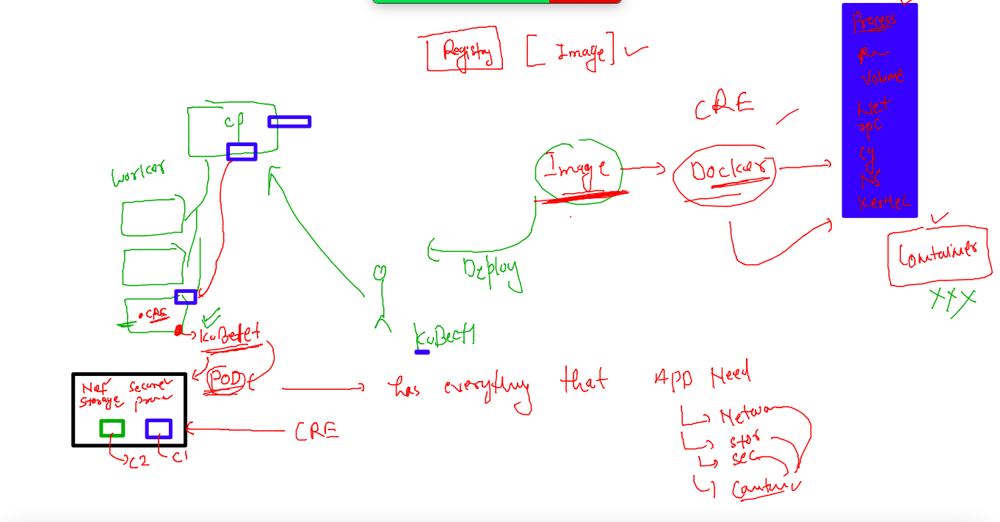

## First Pod YAML 

```
apiVersion: v1 # the apiVersion to accept pod related request 
kind: Pod 
metadata: # info about Kind type 
  name: ashupod-1  # name of pod 
spec: # everything which pod need will be under spec --like volume,network ,security,containers
  containers: 
  - name: ashuc1 
    image: docker.io/dockerashu/ashunginx:1.0 # image from docker hub 
    ports:
    - containerPort: 80 # app port which is running inside container 
  
```

### lets deploy it 

```
[ashu@docker-ce ashu-images]$ cd deploy-app-k8s/
[ashu@docker-ce deploy-app-k8s]$ ls
ashu-app.yaml
[ashu@docker-ce deploy-app-k8s]$ kubectl   apply -f  ashu-app.yaml 
pod/ashupod-1 created
[ashu@docker-ce deploy-app-k8s]$ kubectl   get  pods
NAME        READY   STATUS    RESTARTS   AGE
ashupod-1   1/1     Running   0          10s
[ashu@docker-ce deploy-app-k8s]$ 

```

### more pod status 

```
[ashu@docker-ce ~]$ kubectl   get po ashupod-1   
NAME        READY   STATUS    RESTARTS   AGE
ashupod-1   1/1     Running   0          12m
[ashu@docker-ce ~]$ 
[ashu@docker-ce ~]$ kubectl   get po ashupod-1    -owide
NAME        READY   STATUS    RESTARTS   AGE   IP                NODE      NOMINATED NODE   READINESS GATES
ashupod-1   1/1     Running   0          13m   192.168.235.132   worker1   <none>           <none>
[ashu@docker-ce ~]$ 
```

### more pod commands 

```
[ashu@docker-ce ~]$ kubectl   exec -it ashupod-1 -- bash 
root@ashupod-1:/# 
root@ashupod-1:/# 
root@ashupod-1:/# 
root@ashupod-1:/# ls
bin   dev		   docker-entrypoint.sh  home  lib64  mnt  proc  run   srv  tmp  var
boot  docker-entrypoint.d  etc			 lib   media  opt  root  sbin  sys  usr
root@ashupod-1:/# exit
exit
[ashu@docker-ce ~]$ 
[ashu@docker-ce ~]$ kubectl  delete pod ashupod-1
pod "ashupod-1" deleted
[ashu@docker-ce ~]$ 

```

### question 

```
1. Create pod named  <yourname>pod1
  2. In POd docker image will be busybox 
  3. choose ping fb.com as default process
  4. check output of default process and store in a file  called logs.txt in client machine 
  5. now transfer logs.txt on your pods under /opt/logs.txt 
  6. check that pods is scheduled in which minion node and store that name in logs.txt inside pod 
  7. make sure previous data in logs.txt must be present
  
```


