# Training plan 


### Docker container of java analysis 

```
ashu@docker-ce ashu-images]$ docker images  |  grep ashu
ashujava             appv1     dda6a22b3b03   18 hours ago    467MB
[ashu@docker-ce ashu-images]$ docker run -itd --name ashujc1 dda6a22b3b03 
cf5dc8b1ef09623cb0f04c7f23d1030d2a8f4bbaa799e4bd09c2f62a42ed338c
[ashu@docker-ce ashu-images]$ docker ps
CONTAINER ID   IMAGE          COMMAND                    CREATED         STATUS        PORTS     NAMES
cf5dc8b1ef09   dda6a22b3b03   "/bin/sh -c {\"java\",…"   2 seconds ago   Up 1 second             ashujc1
[ashu@docker-ce ashu-images]$ docker logs ashujc1
Hello World, I am Rajeshwaran
Hello World, I am Rajeshwaran
Hello World, I am Rajeshwaran
Hello World, I am Rajeshwaran
[ashu@docker-ce ashu-images]$ docker exec -it ashujc1  bash 
bash-4.4# 
bash-4.4# java -version 
openjdk version "18.0.2.1" 2022-08-18
OpenJDK Runtime Environment (build 18.0.2.1+1-1)
OpenJDK 64-Bit Server VM (build 18.0.2.1+1-1, mixed mode, sharing)
bash-4.4# jps
1 ashu
50 Jps
bash-4.4# cat  /etc/os-release 
NAME="Oracle Linux Server"
VERSION="8.7"
ID="ol"
ID_LIKE="fedora"
VARIANT="Server"
VARIANT_ID="server"
VERSION_ID="8.7"
PLATFORM_ID="platform:el8"
PRETTY_NAME="Oracle Linux Server 8.7"
ANSI_COLOR="0;31"
CPE_NAME="cpe:/o:oracle:linux:8:7:server"
HOME_URL="https://linux.oracle.com/"
BUG_REPORT_URL="https://bugzilla.oracle.com/"

ORACLE_BUGZILLA_PRODUCT="Oracle Linux 8"
ORACLE_BUGZILLA_PRODUCT_VERSION=8.7
ORACLE_SUPPORT_PRODUCT="Oracle Linux"
ORACLE_SUPPORT_PRODUCT_VERSION=8.7
bash-4.4# exit
exit
```
### jdk11.dockerfile 

```
FROM oraclelinux:8.4 
LABEL name=ashutoshh
LABEL email=ashutoshh@linux.com 
RUN yum install java-11-openjdk.x86_64 java-11-openjdk-devel.x86_64 -y 
RUN mkdir /javacode 
COPY ashu.java /javacode/
WORKDIR /javacode
RUN javac ashu.java
CMD ["java","ashu"]

```

### lets build it 

```
ashu@docker-ce ashu-images]$ docker images  |   grep ashu
ashujava             appv1     dda6a22b3b03   18 hours ago    467MB
[ashu@docker-ce ashu-images]$ 
[ashu@docker-ce ashu-images]$ ls
java-app  python-apps
[ashu@docker-ce ashu-images]$ cd  java-app/
[ashu@docker-ce java-app]$ ls
ashu.java  Dockerfile  jdk11.dockerfile
[ashu@docker-ce java-app]$ docker build  -t  ashujava:appv2  -f  jdk11.dockerfile   . 
Sending build context to Docker daemon  4.608kB
Step 1/9 : FROM oraclelinux:8.4
 ---> 97e22ab49eea
Step 2/9 : LABEL name=ashutoshh
 ---> Running in f894e3448061
Removing intermediate container f894e3448061
 ---> deaa4b459bc3
Step 3/9 : LABEL email=ashutoshh@linux.com
 ---> Running in d8240e3b567c
Removing intermediate container 
```

### lets verify 

```
shu@docker-ce java-app]$ 
[ashu@docker-ce java-app]$ docker images  |   grep ashu
ashujava             appv2     a2de1c0759d7   15 seconds ago       672MB
ashujava             appv1     dda6a22b3b03   18 hours ago         467MB
```

### creating container

```
[ashu@docker-ce java-app]$ docker run -itd --name ashujc2  ashujava:appv2 
7c19e70f647304d9736bf5f84e21cc9003d1ccf392ed710755f84b1f91f183d7

[ashu@docker-ce java-app]$ 
[ashu@docker-ce java-app]$ docker logs ashujc2
Hello World ,i am ashutoshh singh
Hello World ,i am ashutoshh singh
[ashu@docker-ce java-app]$ docker exec -it ashujc2 bash 
[root@7c19e70f6473 javacode]# java -version 
openjdk version "11.0.17" 2022-10-18 LTS
OpenJDK Runtime Environment (Red_Hat-11.0.17.0.8-2.el8_6) (build 11.0.17+8-LTS)
OpenJDK 64-Bit Server VM (Red_Hat-11.0.17.0.8-2.el8_6) (build 11.0.17+8-LTS, mixed mode, sharing)
[root@7c19e70f6473 javacode]# cat /etc/os-release 
NAME="Oracle Linux Server"
VERSION="8.4"
ID="ol"
ID_LIKE="fedora"
VARIANT="Server"
VARIANT_ID="server"
VERSION_ID="8.4"
PLATFORM_ID="platform:el8"
PRETTY_NAME="Oracle Linux Server 8.4"
ANSI_COLOR="0;31"
CPE_NAME="cpe:/o:oracle:linux:8:4:server"
HOME_URL="https://linux.oracle.com/"
BUG_REPORT_URL="https://bugzilla.oracle.com/"

ORACLE_BUGZILLA_PRODUCT="Oracle Linux 8"
ORACLE_BUGZILLA_PRODUCT_VERSION=8.4
ORACLE_SUPPORT_PRODUCT="Oracle Linux"
ORACLE_SUPPORT_PRODUCT_VERSION=8.4
[root@7c19e70f6473 javacode]# exit
exit
```

### java code dockerifle view 

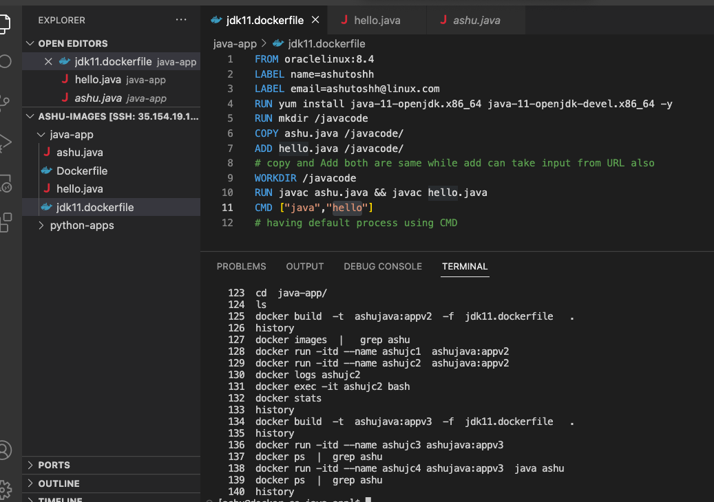

## More app to containerize 

### webapps examples 

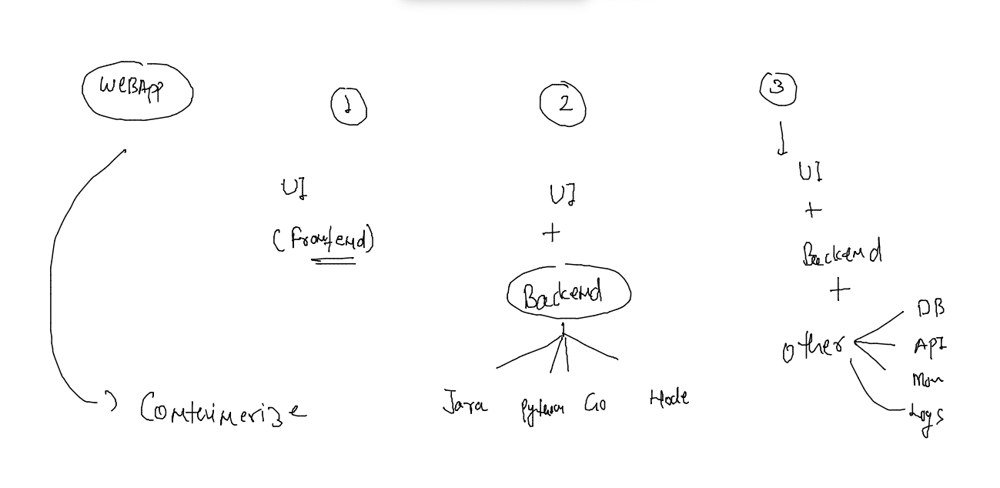

### Understanding about webapp servers

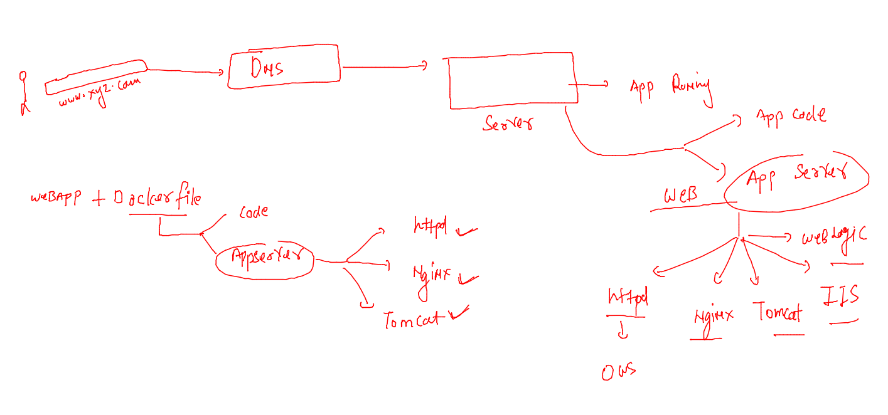

### nginx webapp with sample frontend app hosting 

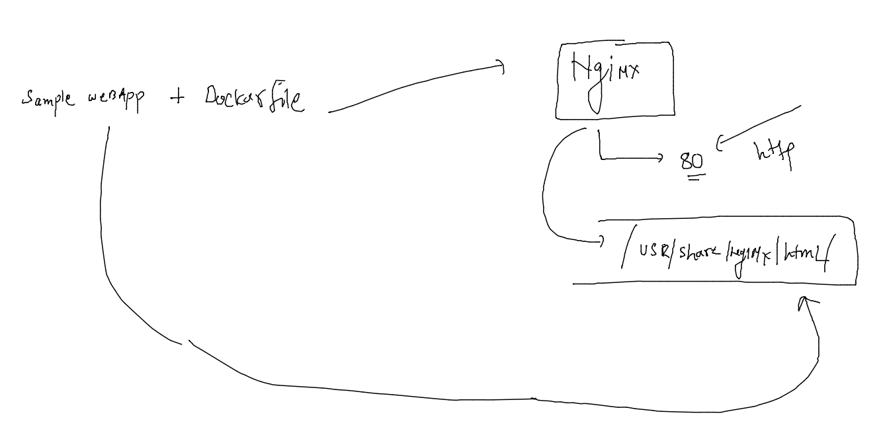

### demo 

```
[ashu@docker-ce ashu-images]$ git clone https://github.com/schoolofdevops/html-sample-app.git
Cloning into 'html-sample-app'...
remote: Enumerating objects: 74, done.
remote: Total 74 (delta 0), reused 0 (delta 0), pack-reused 74
Receiving objects: 100% (74/74), 1.38 MiB | 23.56 MiB/s, done.
Resolving deltas: 100% (5/5), done.
[ashu@docker-ce ashu-images]$ ls
html-sample-app  java-app  python-apps
[ashu@docker-ce ashu-images]$ 

```

### Dockerfile -- using nginx server 

```
FROM nginx 
# taking nginx image from docker hub
LABEL name=ashutoshh
COPY . /usr/share/nginx/html/
# copy all the data from dockerfile location to nginx default app location 
# Note: if we don't use CMD then -- base image CMD will be inherited 
```


### .dockerignroe to ingore copy 

```
.dockerignore
Dockerfile
*.txt
.git 
```

### lets build it 

```

[ashu@docker-ce ashu-images]$ ls
html-sample-app  java-app  python-apps
[ashu@docker-ce ashu-images]$ docker  build -t ashunginx:1.0  html-sample-app/ 
Sending build context to Docker daemon  2.099MB
Step 1/3 : FROM nginx
latest: Pulling from library/nginx
a603fa5e3b41: Pull complete 
c39e1cda007e: Pull complete 
90cfefba34d7: Pull complete 
a38226fb7aba: Pull complete 
62583498bae6: Pull complete 
9802a2cfdb8d: Pull complete 
Digest: sha256:e209ac2f37c70c1e0e9873a5f7231e91dcd83fdf1178d8ed36c2ec09974210ba
Status: Downloaded newer image for nginx:latest
 ---> 88736fe82739
Step 2/3 : LABEL name=ashutoshh
 ---> Running in 436268d1a661
Removing intermediate container 436268d1a661
 ---> e74764e06fab
Step 3/3 : COPY . /usr/share/nginx/html/
 ---> 7eb69787a3a5
Successfully built 7eb69787a3a5
Successfully tagged ashunginx:1.0
[ashu@docker-ce ashu-images]$ docker images  |  grep ashu
ashunginx            1.0         7eb69787a3a5   9 seconds ago       144MB
ashujava             appv3       1357fe309c38   53 minutes ago      672MB
ashu.java            appDay2     d516a815c2fe   About an hour ago   672MB
ashujava             appDay2     d516a815c2fe   About an hour ago   672MB
ashujava             appv2       a2de1c0759d7   About an hour ago   672MB
ashujava             appv1       dda6a22b3b03   20 hours ago        467MB
```


# Introduction to container networking 

### COntainer networking model 

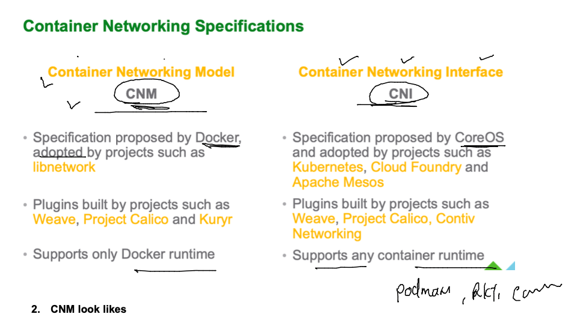

### container networking concept 

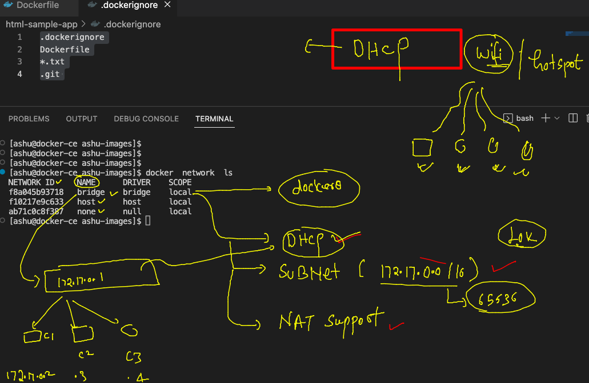

### networking topology 

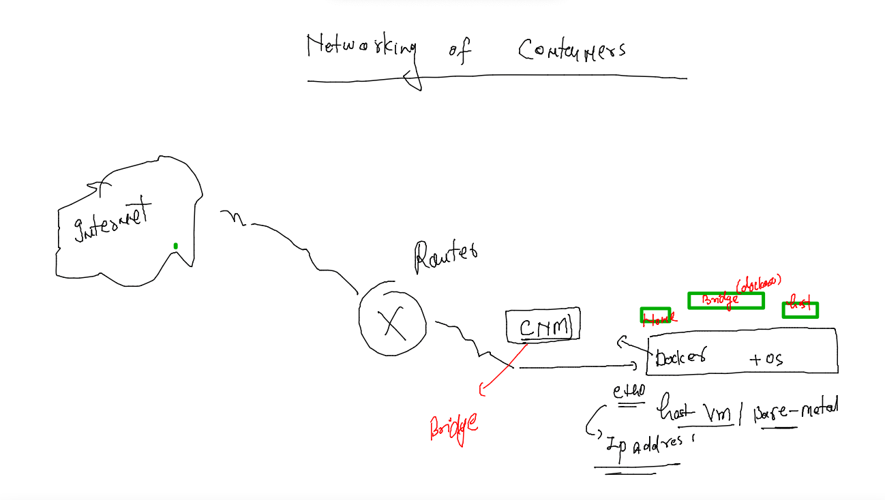

### checking netwoking 

```
[ashu@docker-ce ashu-images]$ docker  network  ls
NETWORK ID     NAME      DRIVER    SCOPE
f8a045b93718   bridge    bridge    local
f10217e9c633   host      host      local
ab71c0c8f387   none      null      local
[ashu@docker-ce ashu-images]$ docker  network  inspect  f8a045b93718
[
    {
        "Name": "bridge",
        "Id": "f8a045b9371844b6884272481533c781344a6c8c78a6d955a507286338a3b109",
        "Created": "2022-11-29T03:55:13.082439023Z",
        "Scope": "local",
        "Driver": "bridge",
        "EnableIPv6": false,
        "IPAM": {
            "Driver": "default",
            "Options": null,
            "Config": [
                {
                    "Subnet": "172.17.0.0/16",
                    "Gateway": "172.17.0.1"
                }
            ]
        },
        "Internal": false,
        "Attachable": false,
        "Ingress": false,
        "ConfigFrom": {
            "Network": ""
```

### checking container networking details 

```
[ashu@docker-ce ashu-images]$ docker images |  grep ashu
ashunginx            1.0         7eb69787a3a5   22 minutes ago      144MB
ashujava             appv3       1357fe309c38   About an hour ago   672MB
ashu.java            appDay2     d516a815c2fe   About an hour ago   672MB
ashujava             appDay2     d516a815c2fe   About an hour ago   672MB
ashujava             appv2       a2de1c0759d7   2 hours ago         672MB
ashujava             appv1       dda6a22b3b03   20 hours ago        467MB
[ashu@docker-ce ashu-images]$ docker run -d --name ashungc1 ashunginx:1.0 
2181c1ea80417897b162213d516e57bd9376f9c3a00ffcb000033dd81bf23fed
[ashu@docker-ce ashu-images]$ docker  network  ls
NETWORK ID     NAME      DRIVER    SCOPE
f8a045b93718   bridge    bridge    local
f10217e9c633   host      host      local
ab71c0c8f387   none      null      local
[ashu@docker-ce ashu-images]$ docker ps
CONTAINER ID   IMAGE           COMMAND                  CREATED          STATUS          PORTS     NAMES
a2c220c14f4a   asifnginx:1.0   "/docker-entrypoint.…"   43 seconds ago   Up 42 seconds   80/tcp    asifc5
2181c1ea8041   ashunginx:1.0   "/docker-entrypoint.…"   2 minutes ago    Up 2 minutes    80/tcp    ashungc1
[ashu@docker-ce ashu-images]$ 
```

### checking particular container ip 

```
[ashu@docker-ce ashu-images]$ docker  inspect ashungc1   |   grep -i ipaddress
            "SecondaryIPAddresses": null,
            "IPAddress": "172.17.0.2",
                    "IPAddress": "172.17.0.2",
[ashu@docker-ce ashu-images]$ 
```

### to access anything outside host container will be using hostIP address -- called NAT 

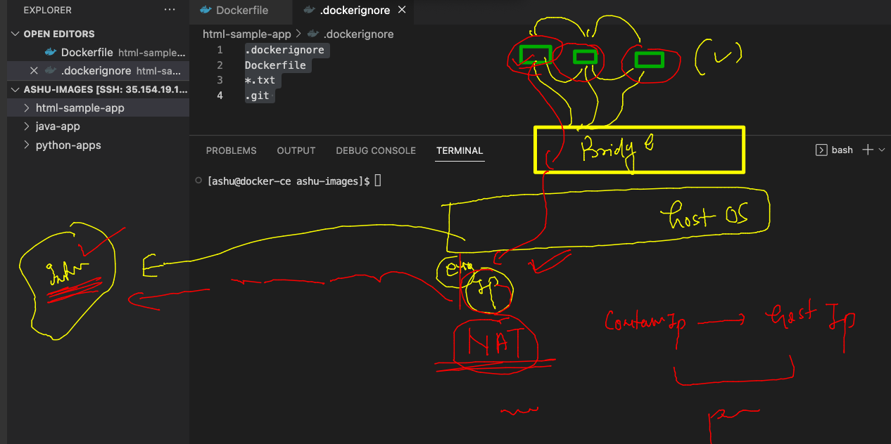

### port mapping concept -- for external user access 

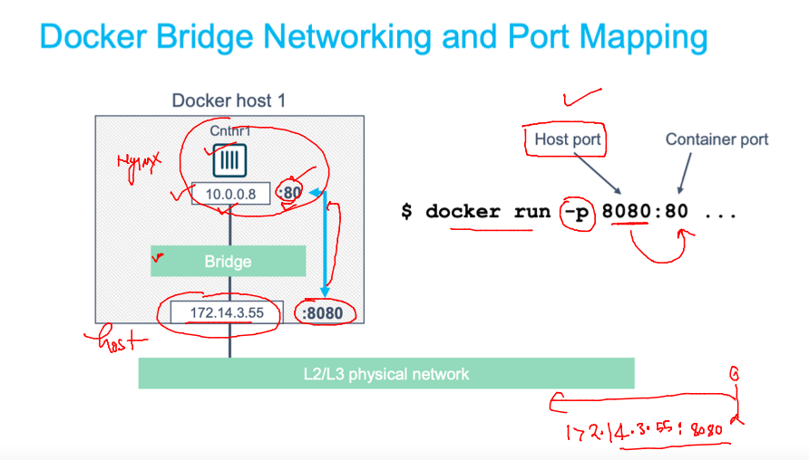

### implement 

```
[ashu@docker-ce ashu-images]$ docker run -d --name ashungc1  -p  1234:80      ashunginx:1.0 
805c53416e5706181b23f714f7de9c4ed4f937d956bb561cc551c80ab057bd0d
[ashu@docker-ce ashu-images]$ docker ps
CONTAINER ID   IMAGE           COMMAND                  CREATED         STATUS         PORTS                                   NAMES
805c53416e57   ashunginx:1.0   "/docker-entrypoint.…"   4 seconds ago   Up 2 seconds   0.0.0.0:1234->80/tcp, :::1234->80/tcp   ashungc1
[ashu@docker-ce ashu-images]$ 


```

### COncept to image sharing with Docker hub 

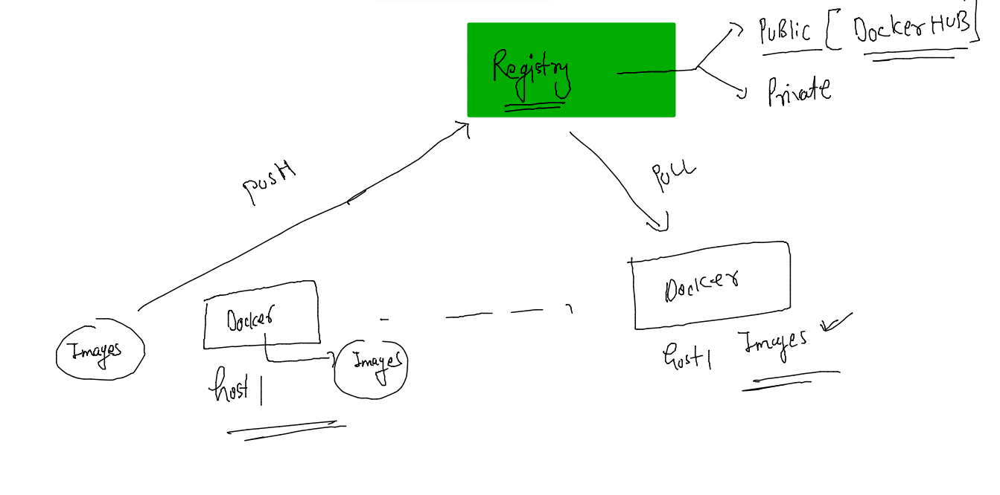

### uNderstanding docker hub image format 

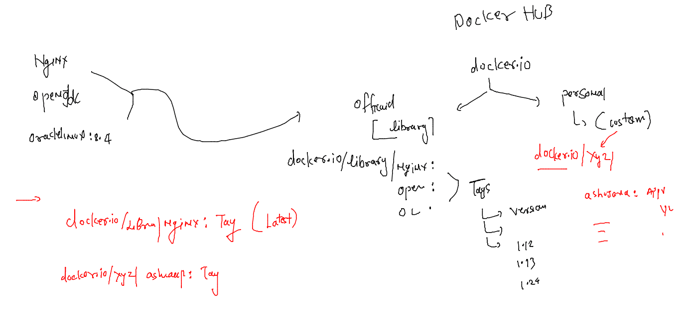

### pushing image to docker hub 

```
[ashu@docker-ce ashu-images]$ docker images   |   grep ashu
ashunginx                           1.0             7eb69787a3a5   3 hours ago         144MB
ashujava                            appv3           1357fe309c38   3 hours ago         672MB
ashu.java                           appDay2         d516a815c2fe   4 hours ago         672MB
ashujava                            appDay2         d516a815c2fe   4 hours ago         672MB
ashujava                            appv2           a2de1c0759d7   4 hours ago         672MB
ashujava                            appv1           dda6a22b3b03   22 hours ago        467MB
[ashu@docker-ce ashu-images]$ docker  tag  ashunginx:1.0   docker.io/dockerashu/ashunginx:1.0 
[ashu@docker-ce ashu-images]$ docker login -u dockerashu
Password: 
WARNING! Your password will be stored unencrypted in /home/ashu/.docker/config.json.
Configure a credential helper to remove this warning. See
https://docs.docker.com/engine/reference/commandline/login/#credentials-store

Login Succeeded
[ashu@docker-ce ashu-images]$ docker push docker.io/dockerashu/ashunginx:1.0
The push refers to repository [docker.io/dockerashu/ashunginx]
ee2471fc5a6c: Pushed 
6cffb086835a: Mounted from library/nginx 
e2d75d87993c: Mounted from library/nginx 
5a5bafd53f76: Mounted from library/nginx 
f86e88a471f4: Mounted from library/nginx 

[ashu@docker-ce ashu-images]$ docker logout 
Removing login credentials for https://index.docker.io/v1/
[ashu@docker-ce ashu-images]$ 
```

