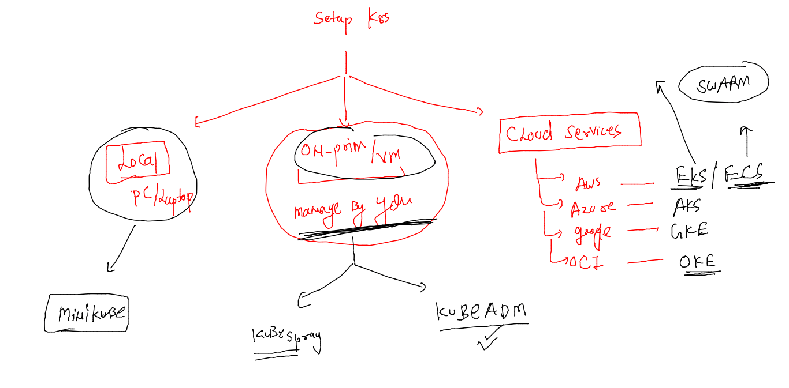
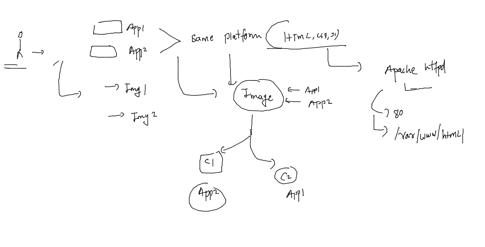

# Training plan 


## ALL Revision 

### setup k8s cluster options 



### a customer story 



## COntainerizing webapps 

### cloning app env 

```
[ashu@docker-ce ashu-images]$ mkdir  ashu-customer
[ashu@docker-ce ashu-images]$ ls
admin.conf    ashu-customer   html-sample-app  javawebapp                python-apps
ashu-compose  deploy-app-k8s  java-app         project-website-template  reactjs
[ashu@docker-ce ashu-images]$ cd  ashu-customer/
[ashu@docker-ce ashu-customer]$ ls
[ashu@docker-ce ashu-customer]$ git clone https://github.com/ShaifArfan/one-page-website-html-css-project.git
Cloning into 'one-page-website-html-css-project'...
remote: Enumerating objects: 52, done.
remote: Total 52 (delta 0), reused 0 (delta 0), pack-reused 52
Receiving objects: 100% (52/52), 347.58 KiB | 1.43 MiB/s, done.
Resolving deltas: 100% (15/15), done.
[ashu@docker-ce ashu-customer]$ git clone https://github.com/microsoft/project-html-website.git
Cloning into 'project-html-website'...
remote: Enumerating objects: 24, done.
remote: Counting objects: 100% (5/5), done.
remote: Compressing objects: 100% (5/5), done.
remote: Total 24 (delta 0), reused 3 (delta 0), pack-reused 19
Receiving objects: 100% (24/24), 465.86 KiB | 15.03 MiB/s, done.
[ashu@docker-ce ashu-customer]$ ls
one-page-website-html-css-project  project-html-website
[ashu@docker-ce ashu-customer]$ 
```

### .dockerignore file 

```
one-page-website-html-css-project/.git
one-page-website-html-css-project/LICENSE
one-page-website-html-css-project/README.md
project-html-website/.git
project-html-website/LICENSE
project-html-website/README.md
project-html-website/SECURITY.md

```

### Dockerfile 

```

```

