# Training plan 


### app testing / deployment problems with bare-metal system in past 

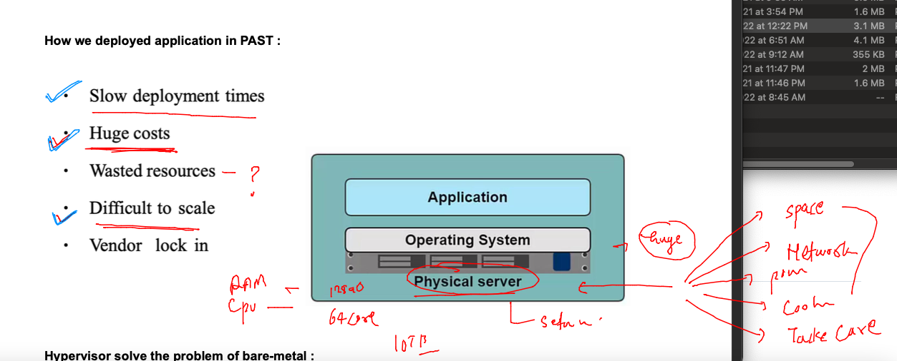

### app conflict problem on same host os Platform 

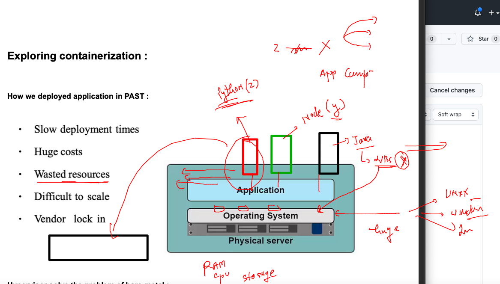

### solving app conflict / isolation using Hypervisor 

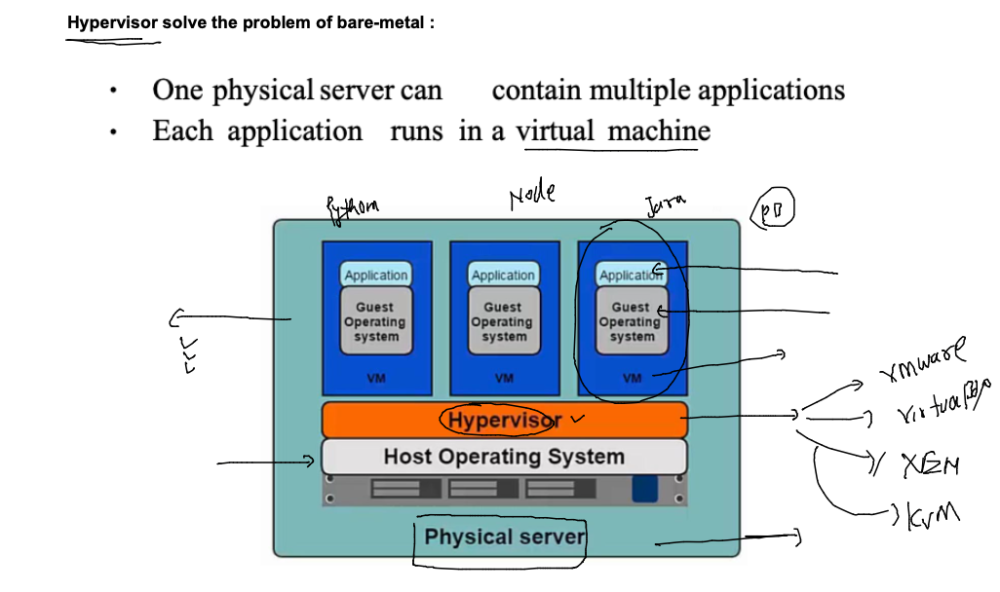

### problem with VM 

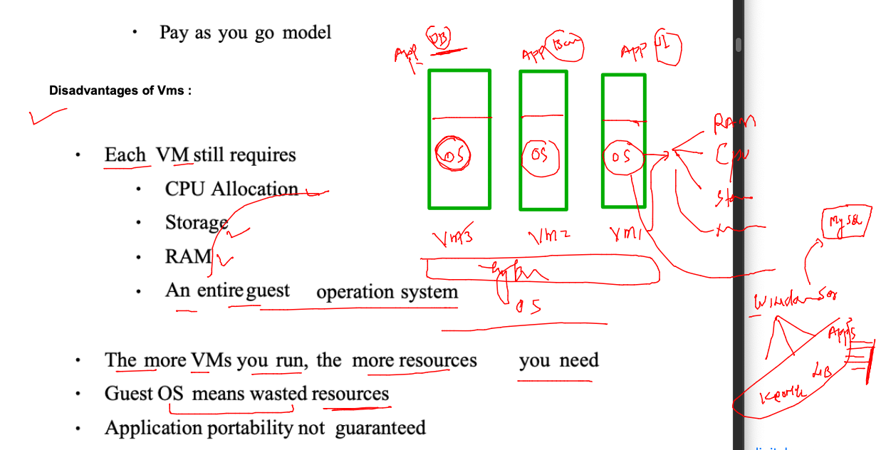

### vm vs container 

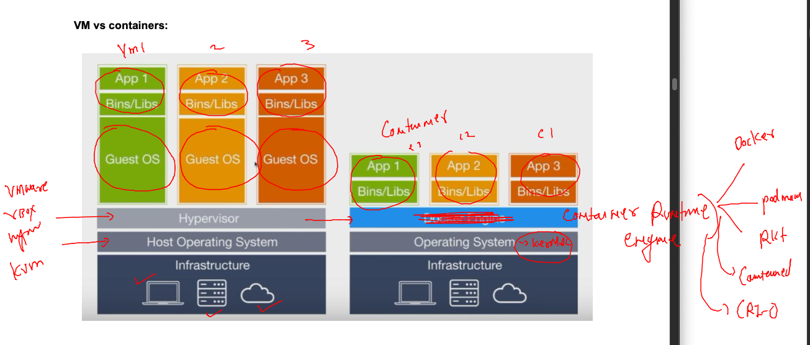

## Introduction to Docker 

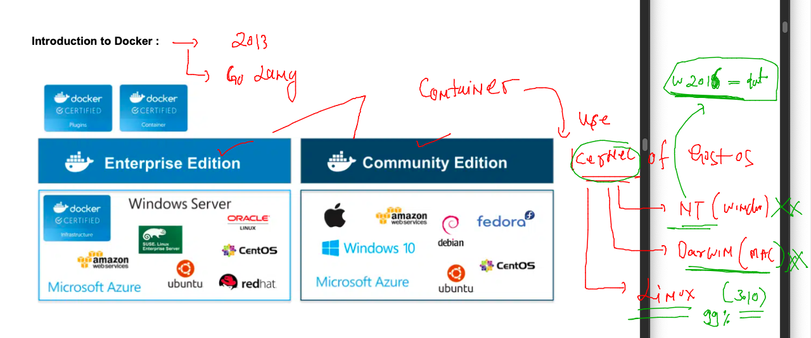

### install docker in any Linux platform -- /bare-metal / vm / cloud vm 

### checking things on linux vm 

```
[root@docker-ce ~]# whoami
root
[root@docker-ce ~]# uname -r
5.10.147-133.644.amzn2.x86_64
[root@docker-ce ~]# docker 
-bash: docker: command not found
[root@docker-ce ~]# 

```

### link for docker ce installation 

[click_here](https://docs.docker.com/engine/install/)

### installing docker on linux using yum 

```
[root@ip-172-31-29-98 ~]# yum  install docker 
Failed to set locale, defaulting to C
Loaded plugins: extras_suggestions, langpacks, priorities, update-motd
Resolving Dependencies
--> Running transaction check
---> Package docker.x86_64 0:20.10.17-1.amzn2.0.1 will be installed
--> Processing Dependency: runc >= 1.0.0 for package: docker-20.10.17-1.amzn2.0.1.x86_64
--> Processing Dependency: libcgroup >= 0.40.rc1-5.15 for package: docker-20.10.17-1.amzn2.0.1.x86_64
--> Processing Dependency: containerd >= 1.3.2 for package: docker-20.10.17-1.amzn2.0.1.x86_64
--> Processing Dependency: pigz for package: docker-20.10.17-1.amzn2.0.1.x86_64
--> Running transaction check
---> Package containerd.x86_64 0:1.6.6-1.amzn2.0.2 will be installed
---> Package libcgroup.x86_64 0:0.41-21.amzn2 will be installed

```

### creating non root user accounts and giving docker access 

```
root@ip-172-31-29-98 ~]# for  i in  ashu anurag arpit asif dhruba mamta niladri prakash pranav prashanth rajeshwaran sameer     shijin sindhu vijaya 
> do
> useradd $i
> echo "Oracle@098#"  |  passwd $i --stdin 
> usermod -aG docker $i
> done 
```

### trying to docker server 

```
[ashu@docker-ce ~]$ whoami
ashu
[ashu@docker-ce ~]$ uname -r
5.10.147-133.644.amzn2.x86_64
[ashu@docker-ce ~]$ 
[ashu@docker-ce ~]$ docker version 
Client:
 Version:           20.10.17
 API version:       1.41
 Go version:        go1.18.6
 Git commit:        100c701
 Built:             Wed Sep 28 23:10:17 2022
 OS/Arch:           linux/amd64
 Context:           default
 Experimental:      true
Cannot connect to the Docker daemon at unix:///var/run/docker.sock. Is the docker daemon running?
[ashu@docker-ce ~]$ 


```

### lets start docker service 

```
[root@docker-ce ~]# systemctl start docker 
[root@docker-ce ~]# systemctl enable docker 
Created symlink from /etc/systemd/system/multi-user.target.wants/docker.service to /usr/lib/systemd/system/docker.service.
[root@docker-ce ~]# systemctl status  docker 
● docker.service - Docker Application Container Engine
   Loaded: loaded (/usr/lib/systemd/system/docker.service; enabled; vendor preset: disabled)
   Active: active (running) since Mon 2022-11-28 06:39:29 UTC; 9s ago
     Docs: https://docs.docker.com
 Main PID: 4011 (dockerd)
   CGroup: /system.slice/docker.service
           └─4011 /usr/bin/dockerd -H fd:// --containerd=/run/containerd/containerd.sock --default-ulimit nofile=32768:6553...


```

### Docker client & docker server 

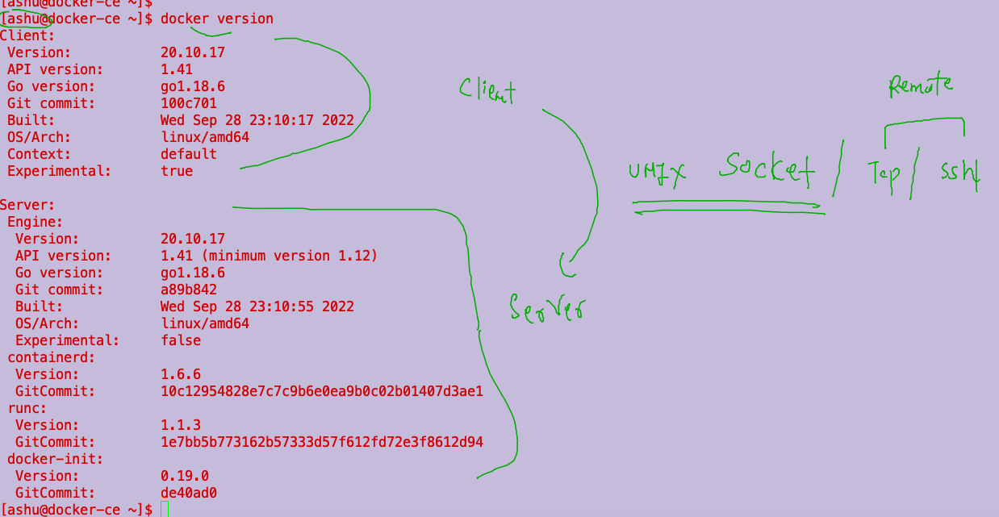

### understanding creating containers  using contaienr images 

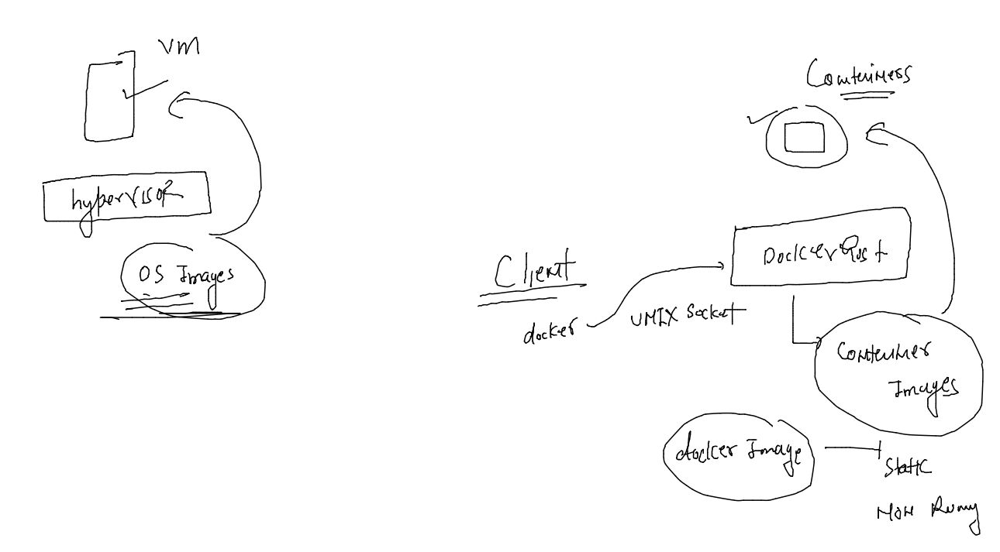

## image operations 

### pull and check 

```
[ashu@docker-ce ~]$ docker  images
REPOSITORY   TAG       IMAGE ID   CREATED   SIZE
[ashu@docker-ce ~]$ docker pull mysql 
Using default tag: latest
latest: Pulling from library/mysql
0bb5c0c24818: Pull complete 
cbb3106fbb5a: Pull complete 
550536ae1d5e: Pull complete 
33f98928796e: Pull complete 
a341087cff11: Pull complete 
0e26ac5b33f6: Pull complete 
c883b83a7112: Pull complete 
873af5c876c6: Pull complete 
8fe8ebd061d5: Pull complete 
7ac2553cf6b4: Pull complete 
ad655e218e12: Pull complete 
Digest: sha256:96439dd0d8d085cd90c8001be2c9dde07b8a68b472bd20efcbe3df78cff66492
Status: Downloaded newer image for mysql:latest
docker.io/library/mysql:latest
[ashu@docker-ce ~]$ docker  images
REPOSITORY   TAG       IMAGE ID       CREATED       SIZE
mysql        latest    3842e9cdffd2   11 days ago   538MB
[ashu@docker-ce ~]$ 

```

### oracle linux image pull 

```
[ashu@docker-ce ~]$ docker pull oraclelinux:8.4 
8.4: Pulling from library/oraclelinux
a4df6f21af84: Pull complete 
Digest: sha256:b81d5b0638bb67030b207d28586d0e714a811cc612396dbe3410db406998b3ad
Status: Downloaded newer image for oraclelinux:8.4
docker.io/library/oraclelinux:8.4
[ashu@docker-ce ~]$ 
[ashu@docker-ce ~]$ 
[ashu@docker-ce ~]$ docker  images
REPOSITORY    TAG       IMAGE ID       CREATED         SIZE
mysql         latest    3842e9cdffd2   11 days ago     538MB
oraclelinux   8.4       97e22ab49eea   12 months ago   246MB
```

### downloading from quay 

```
[ashu@docker-ce ~]$ docker pull quay.io/cki/python
Using default tag: latest
latest: Pulling from cki/python
7a05f01240ab: Pull complete 
343808d3e526: Pull complete 
Digest: sha256:793e74eb1965a466d20aa787b916595ae8efac29be7f7ba740a05c4f1d1502d4
Status: Downloaded newer image for quay.io/cki/python:latest
quay.io/cki/python:latest
[ashu@docker-ce ~]$ docker  images
REPOSITORY           TAG       IMAGE ID       CREATED         SIZE
oraclelinux          9         0c19a2c2d02f   2 days ago      225MB
quay.io/cki/python   latest    02e3514dbff3   6 days ago      991MB
mongo                latest    2dd27bb6d3e6   11 days ago     695MB
mysql                latest    3842e9cdffd2   11 days ago     538MB
oraclelinux          8.4       97e22ab49eea   12 months ago   246MB
```

## Container management 

### creating container 

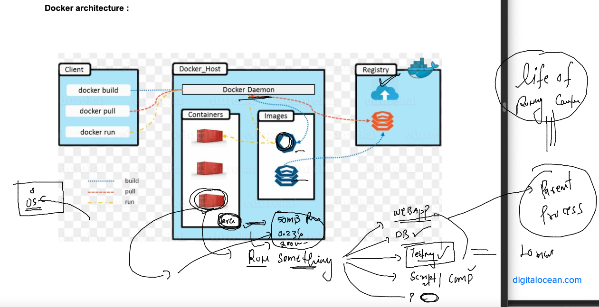

### creating container 

```
[ashu@docker-ce ~]$ docker  run  --name  ashuc1  -it -d  oraclelinux:8.4  sleep 1000 
e011394d291ef6e510b5274fe777c9dd77e4fce8ef1fcf5bf60a29513988cb5c
[ashu@docker-ce ~]$ docker  ps
CONTAINER ID   IMAGE             COMMAND        CREATED              STATUS              PORTS     NAMES
4d7c89f7d784   oraclelinux:8.4   "sleep 1000"   3 seconds ago        Up 2 seconds                  arpitc1
e011394d291e   oraclelinux:8.4   "sleep 1000"   14 seconds ago       Up 13 seconds                 ashuc1
a2fdf34ed22d   oraclelinux:8.4   "bash"         About a minute ago   Up About a minute             dhruba1
[ashu@docker-ce ~]$ 

```

### recreating it 

```
[ashu@docker-ce ~]$ docker images
REPOSITORY           TAG       IMAGE ID       CREATED         SIZE
quay.io/cki/python   latest    02e3514dbff3   6 days ago      991MB
fedora               latest    d1cd7f8c89a9   12 days ago     184MB
oraclelinux          8.4       97e22ab49eea   12 months ago   246MB
[ashu@docker-ce ~]$ 
[ashu@docker-ce ~]$ docker  ps
CONTAINER ID   IMAGE     COMMAND   CREATED   STATUS    PORTS     NAMES
[ashu@docker-ce ~]$ 
[ashu@docker-ce ~]$ docker run --name ashuc1 -itd  oraclelinux:8.4  sleep 1000 
d3475adee03f7b055ea2da62593b029401eb453112d8709be706e4c79c5cbc16
[ashu@docker-ce ~]$ docker  ps
CONTAINER ID   IMAGE             COMMAND        CREATED          STATUS          PORTS     NAMES
19fe7498234a   oraclelinux:8.4   "sleep 1000"   3 seconds ago    Up 2 seconds              sindhu1
d3475adee03f   oraclelinux:8.4   "sleep 1000"   4 seconds ago    Up 3 seconds              ashuc1
7e68200f6bfc   oraclelinux:8.4   "sleep 1000"   18 seconds ago   Up 17 seconds             dhruba1
ccfc4692f882   oraclelinux:8.4   "sleep 1000"   29 seconds ago   Up 27 seconds             shijin
2235821361fa   oraclelinux:8.4   "sleep 100"    35 seconds ago   Up 33 seconds             vijaya
[ashu@docker-ce ~]$ 

```

### to list all the containers 

```
[ashu@docker-ce ~]$ docker ps -a
CONTAINER ID   IMAGE             COMMAND        CREATED              STATUS                          PORTS     NAMES
dfb500a60171   oraclelinux:8.4   "mycon"        21 seconds ago       Created                                   asif2
9452279d1b4f   oraclelinux:8.4   "sleep 1000"   50 seconds ago       Up 49 seconds                             prao1
50201182afc7   oraclelinux:8.4   "sleep 10"     51 seconds ago       Exited (0) 40 seconds ago                 dhruba1
db195dd42a58   oraclelinux:8.4   "sleep 100"    About a minute ago   Up About a minute                         niladri1
6fb42e55bf6a   oraclelinux:8.4   "sleep 1000"   About a minute ago   Up About a minute                         rajesh
d3ef610f93da   oraclelinux:8.4   "sleep 100"    About a minute ago   Exited (137) 21 seconds ago               prao
6c4becb87116   oraclelinux:8.4   "sleep 1000"   About a minute ago   Up About a minute                         arpitc2
16a0ea8dca2b   fedora:latest     "sleep 1000"   About a minute ago   Up About a minute                         pranav

```

### stop and start 

```
ashu@docker-ce ~]$ docker  stop  ashuc1 
ashuc1
===
[ashu@docker-ce ~]$ docker  start  ashuc1
ashuc1
[ashu@docke
```

### accessing container shell 

```
[ashu@docker-ce ~]$ docker  exec -it ashuc1  bash
[root@d3475adee03f /]# 
[root@d3475adee03f /]# 
[root@d3475adee03f /]# uname -r
5.10.147-133.644.amzn2.x86_64
[root@d3475adee03f /]# cat  /etc/os-release 
NAME="Oracle Linux Server"
VERSION="8.4"
ID="ol"
ID_LIKE="fedora"
VARIANT="Server"
VARIANT_ID="server"
VERSION_ID="8.4"
PLATFORM_ID="platform:el8"
PRETTY_NAME="Oracle Linux Server 8.4"
ANSI_COLOR="0;31"
CPE_NAME="cpe:/o:oracle:linux:8:4:server"
HOME_URL="https://linux.oracle.com/"
BUG_REPORT_URL="https://bugzilla.oracle.com/"

ORACLE_BUGZILLA_PRODUCT="Oracle Linux 8"
ORACLE_BUGZILLA_PRODUCT_VERSION=8.4
ORACLE_SUPPORT_PRODUCT="Oracle Linux"
ORACLE_SUPPORT_PRODUCT_VERSION=8.4
[root@d3475adee03f /]# 
[root@d3475adee03f /]# ls /
bin  boot  dev  etc  home  lib  lib64  media  mnt  opt  proc  root  run  sbin  srv  sys  tmp  usr  var
[root@d3475adee03f /]# 
[root@d3475adee03f /]# exit
exit
[ashu@docker-ce ~]$ 

```

### remove a running container 

```
[ashu@docker-ce ~]$ 
[ashu@docker-ce ~]$ docker stop ashuc1
ashuc1
[ashu@docker-ce ~]$ docker rm ashuc1 
ashuc1
[ashu@docker-ce ~]$ 
[ashu@docker-ce ~]$ docker start ashuc1
Error response from daemon: No such container: ashuc1
Error: failed to start containers: ashuc1
[ashu@docker-ce ~]$ 
[ashu@docker-ce ~]$ 

```

### contianer life cycle management 

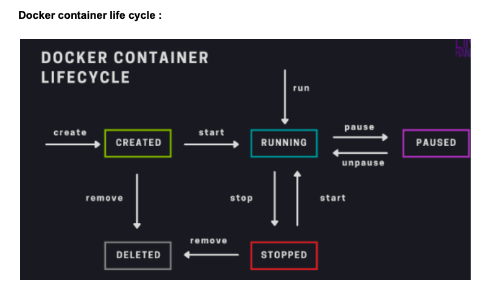


### task solution to copy data from 1st container to 2nd container 

```
[ashu@docker-ce ~]$ docker run -itd --name ashuc1 oraclelinux:8.4 sleep 1000
f33a9b3b91769144c0e1b0e3fe0041cb9a29b97505348e53375cc516c84446f6
[ashu@docker-ce ~]$ 
[ashu@docker-ce ~]$ 
[ashu@docker-ce ~]$ docker run -itd --name ashuc2 oraclelinux:8.4 sleep 1000
b1202a1a355a0b0ca036514df4e605188036b50920d12af08ee73c0054af109c
[ashu@docker-ce ~]$ 
[ashu@docker-ce ~]$ docker  ps  |  grep ashu
b1202a1a355a   oraclelinux:8.4   "sleep 1000"    8 seconds ago    Up 7 seconds                      ashuc2
f33a9b3b9176   oraclelinux:8.4   "sleep 1000"    14 seconds ago   Up 12 seconds                     ashuc1
[ashu@docker-ce ~]$ 
[ashu@docker-ce ~]$ 
[ashu@docker-ce ~]$ docker exec -it ashuc1  bash 
[root@f33a9b3b9176 /]# 
[root@f33a9b3b9176 /]# echo hi i am ashutoshh singh >/tmp/helloc1.txt 
[root@f33a9b3b9176 /]# 
[root@f33a9b3b9176 /]# ls /tmp/
helloc1.txt
[root@f33a9b3b9176 /]# 
[root@f33a9b3b9176 /]# exit
exit
[ashu@docker-ce ~]$ docker  cp  ashuc1:/tmp/helloc1.txt  . 
[ashu@docker-ce ~]$ ls
helloc1.txt
[ashu@docker-ce ~]$ docker  cp  helloc1.txt   ashuc2:/tmp/
[ashu@docker-ce ~]$ 
[ashu@docker-ce ~]$ docker  exec  ashuc2  ls /tmp
helloc1.txt

```

## Creating custom Images -- using Dockerfile 

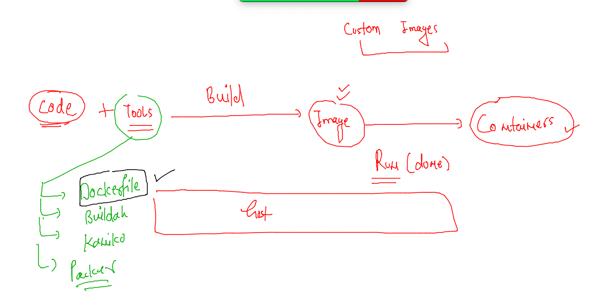

### creating sample java code based docker image

### code 

```
class ashu { 
    public static void main(String args[]) 
    { 
        // test expression 
        while (true) { 
            System.out.println("Hello World ,i am ashutoshh singh"); 
            try {
                Thread.sleep(2000);
            } catch (Exception ex) {
                // Ignored
            }
  
            // update expression 
        } 
    } 
} 
```

### Dockerile 

```
 FROM openjdk
# we are refering to jdk support by above image 
LABEL name=ashutoshh
LABEL email=ashutoshh@linux.com 
# optional field but image developer info 
RUN mkdir /mycode 
# RUN can give shell access while image building 
COPY ashu.java /mycode/
# copy code from docker client to newly created image during image build time
WORKDIR /mycode
# use to change directory while image build process
RUN javac ashu.java 
# using javac to compile code 
CMD ["java","ashu"]
# setting parent process for this image 
# can be replaced by user while creating container 

```

### lets build it 

```
[ashu@docker-ce ashu-images]$ ls
java-app  python-apps
[ashu@docker-ce ashu-images]$ docker images
REPOSITORY           TAG       IMAGE ID       CREATED         SIZE
oraclelinux          9         0c19a2c2d02f   2 days ago      225MB
quay.io/cki/python   latest    02e3514dbff3   6 days ago      991MB
fedora               latest    d1cd7f8c89a9   12 days ago     184MB
oraclelinux          8.4       97e22ab49eea   12 months ago   246MB
[ashu@docker-ce ashu-images]$ 
[ashu@docker-ce ashu-images]$ 
[ashu@docker-ce ashu-images]$ docker  build  -t  ashujava:appv1   java-app/
Sending build context to Docker daemon  3.584kB
Step 1/8 : FROM openjdk
latest: Pulling from library/openjdk
0bb5c0c24818: Pull complete 
3b2939e28fef: Pull complete 
24540a251b73: Pull complete 
Digest: sha256:d696170b024866d67864c6ae8b0fe2557177d225bca10d507cc7956947224658
Status: Downloaded newer image for openjdk:latest
 ---> 44ca3421c900
Step 2/8 : LABEL name=ashutoshh
 ---> Running in f5ffef0eee23
Removing intermediate container f5ffef0eee23
 ---> 978d66e748e5
Step 3/8 : LABEL email=ashutoshh@linux.com
 ---> Running in 3c26ae3b01ee
Removing intermediate container 3c26ae3b01ee
 ---> 01eb778ecc88
Step 4/8 : RUN mkdir /mycode
 ---> Running in 14d17f769e41
Removing intermediate container 14d17f769e41
 ---> 2b60a9c6f0f8
Step 5/8 : COPY ashu.java /mycode/
 ---> eb916a7b5f02
Step 6/8 : WORKDIR /mycode
 ---> Running in 1d78ff7b7680
Removing intermediate container 1d78ff7b7680
 ---> 7da5504c4e31
Step 7/8 : RUN javac ashu.java
 ---> Running in 40efe41899b7
Removing intermediate container 40efe41899b7
 ---> 6725d89599d4
Step 8/8 : CMD ["java","ashu"]
 ---> Running in 0dab0671c7b1
Removing intermediate container 0dab0671c7b1
 ---> 07f1451e7300
Successfully built 07f1451e7300
Successfully tagged ashujava:appv1
[ashu@docker-ce ashu-images]$ docker images
REPOSITORY           TAG       IMAGE ID       CREATED          SIZE
ashujava             appv1     dda6a22b3b03   8 seconds ago    467MB
asifjava             appv1     4cec1e3ef13c   8 seconds ago    467MB
```

### creating container and checking output 

```
ashu@docker-ce ashu-images]$ docker  run -it -d --name ashujc1  ashujava:appv1  
2695e88b3edab82610e5ec1684aedcf4924ba90cb79abfcfca5b2062b32bf881
[ashu@docker-ce ashu-images]$ docker  ps
CONTAINER ID   IMAGE            COMMAND                    CREATED         STATUS        PORTS     NAMES
2695e88b3eda   ashujava:appv1   "/bin/sh -c {\"java\",…"   2 seconds ago   Up 1 second             ashujc1
[ashu@docker-ce ashu-images]$ docker logs ashujc1
Hello World, I am Rajeshwaran
Hello World, I am Rajeshwaran
Hello World, I am Rajeshwaran
Hello World, I am Rajeshwaran
```

### check resources of containers 

```
[ashu@docker-ce ashu-images]$ docker  stats 

CONTAINER ID   NAME            CPU %     MEM USAGE / LIMIT     MEM %     NET I/O     BLOCK I/O   PIDS
287b143d5887   shijinc1        0.08%     9.23MiB / 7.664GiB    0.12%     710B / 0B   0B / 0B     19
2fb2fc7241d4   vijayac1        0.08%     9.211MiB / 7.664GiB   0.12%     710B / 0B   0B / 0B     19
fc6b08b9aa7e   elated_edison   0.09%     9.277MiB / 7.664GiB   0.12%     710B / 0B   0B / 0B     19
62d1730c8064   RAJESH          0.08%     9.258MiB / 7.664GiB   0.12%     710B / 0B   0B / 0B     19
```


