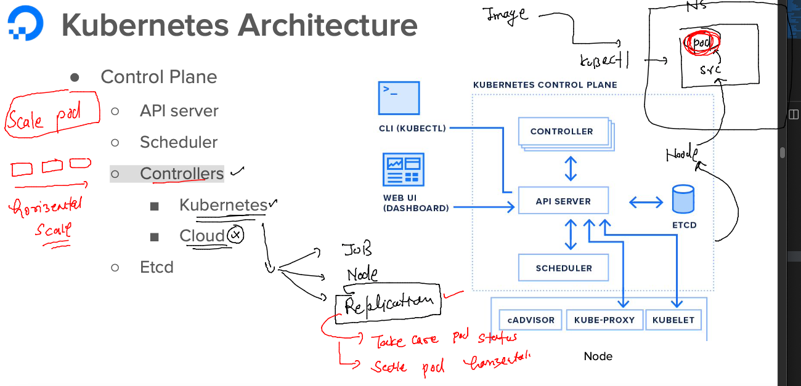
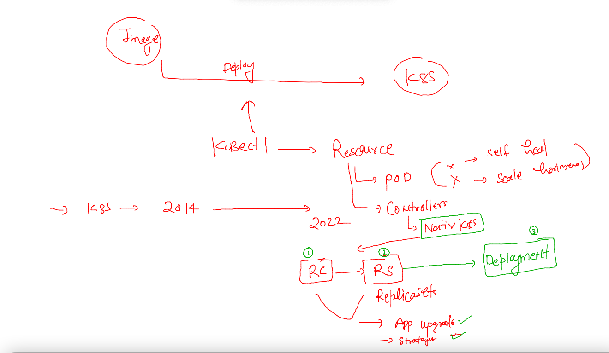

# Training plan 


### pod commands 

```
ashu@docker-ce ashu-images]$ kubectl  get pods
NAME           READY   STATUS             RESTARTS        AGE
anuragpod-1    1/1     Running            1 (49m ago)     17h
arpitpod-1     1/1     Running            1 (49m ago)     17h
dhrubapod-1    1/1     Running            1 (49m ago)     17h
mamtapod-1     1/1     Running            1 (49m ago)     17h
mysample-app   1/1     Running            1 (49m ago)     17h
nilpod-1       1/1     Running            1 (49m ago)     17h
pranavpod-1    1/1     Running            1 (49m ago)     17h
sameerpod-1    1/1     Running            0               23m
sindhupod1     0/1     CrashLoopBackOff   9 (107s ago)    23m
vijayapod1     0/1     CrashLoopBackOff   19 (107s ago)   16h
vpod1          1/1     Running            1 (49m ago)     17h
[ashu@docker-ce ashu-images]$ kubectl  delete pods --all
pod "anuragpod-1" deleted
pod "arpitpod-1" deleted
pod "dhrubapod-1" deleted
pod "mamtapod-1" deleted
pod "mysample-app" deleted
pod "nilpod-1" deleted
pod "pranavpod-1" deleted
```

### creating pod from command line 

```
[ashu@docker-ce deploy-app-k8s]$ kubectl  run  ashupod-2 --image=docker.io/dockerashu/ashunginx:1.0  --port 80 
pod/ashupod-2 created
[ashu@docker-ce deploy-app-k8s]$ kubectl   get  pods
NAME        READY   STATUS    RESTARTS   AGE
ashupod-2   1/1     Running   0          5s
[ashu@docker-ce deploy-app-k8s]$ 


```

### generating yaml pod using kubectl 

```
[ashu@docker-ce deploy-app-k8s]$ kubectl  run  ashupod-2 --image=docker.io/dockerashu/ashunginx:1.0  --port 80 --dry-run=client -o yaml 
apiVersion: v1
kind: Pod
metadata:
  creationTimestamp: null
  labels:
    run: ashupod-2
  name: ashupod-2
spec:
  containers:
  - image: docker.io/dockerashu/ashunginx:1.0
    name: ashupod-2
    ports:
    - containerPort: 80
    resources: {}
  dnsPolicy: ClusterFirst
  restartPolicy: Always
status: {}
[ashu@docker-ce deploy-app-k8s]$ kubectl  run  ashupod-2 --image=docker.io/dockerashu/ashunginx:1.0  --port 80 --dry-run=client -o yaml  >autopod.yaml
[ashu@docker-ce deploy-app-k8s]$ ls
ashu-app.yaml  autopod.yaml
```

### JSON 

```
[ashu@docker-ce deploy-app-k8s]$ kubectl  run  ashupod-2 --image docker.io/dockerashu/ashunginx:1.0  --port=80 --dry-run=client -o json >auto.json 
[ashu@docker-ce deploy-app-k8s]$ ls
ashu-app.yaml  auto.json  autopod.yaml
[ashu@docker-ce deploy-app-k8s]$ 
[ashu@docker-ce deploy-app-k8s]$ kubectl  apply -f auto.json 
pod/ashupod-2 created
[ashu@docker-ce deploy-app-k8s]$ kubectl  get pods
NAME        READY   STATUS             RESTARTS     AGE
ashupod-2   1/1     Running            0            3s
spod2       0/1     CrashLoopBackOff   1 (8s ago)   12s
[ashu@docker-ce deploy-app-k8s]$ kubectl  delete -f auto.json 
pod "ashupod-2" deleted
[ashu@docker-ce deploy-app-k8s]$ 
```

### Namespace concept in k8s 


```
[ashu@docker-ce deploy-app-k8s]$ kubectl   create  namespace  ashu-apps --dry-run=client 
namespace/ashu-apps created (dry run)
[ashu@docker-ce deploy-app-k8s]$ kubectl   create  namespace  ashu-apps --dry-run=client -o yaml
apiVersion: v1
kind: Namespace
metadata:
  creationTimestamp: null
  name: ashu-apps
spec: {}
status: {}
[ashu@docker-ce deploy-app-k8s]$ kubectl   create  namespace  ashu-apps 
namespace/ashu-apps created
[ashu@docker-ce deploy-app-k8s]$ kubectl  config set-context --current --namespace=ashu-apps 
Context "kubernetes-admin@kubernetes" modified.
[ashu@docker-ce deploy-app-k8s]$ kubectl   get  pods
No resources found in ashu-apps namespace.
[ashu@docker-ce deploy-app-k8s]$ 

```

### checking ns and creating pod inside 

```
[ashu@docker-ce deploy-app-k8s]$ kubectl  get  pods
No resources found in ashu-apps namespace.
[ashu@docker-ce deploy-app-k8s]$ 
[ashu@docker-ce deploy-app-k8s]$ kubectl   config get-contexts 
CURRENT   NAME                          CLUSTER      AUTHINFO           NAMESPACE
*         kubernetes-admin@kubernetes   kubernetes   kubernetes-admin   ashu-apps
[ashu@docker-ce deploy-app-k8s]$ ls
ashu-app.yaml  auto.json  autopod.yaml
[ashu@docker-ce deploy-app-k8s]$ kubectl   apply -f ashu-app.yaml 
pod/ashupod-1 created
[ashu@docker-ce deploy-app-k8s]$ kubectl  get pods
NAME        READY   STATUS    RESTARTS   AGE
ashupod-1   1/1     Running   0          3s
[ashu@docker-ce deploy-app-k8s]$ 
```

### multi container pod 

```
apiVersion: v1
kind: Pod
metadata:
  creationTimestamp: null
  labels:
    run: ashupod-2
  name: ashupod-2
spec:
  containers:
  - image: oraclelinux:8.4
    name: ashuc1
    command: ["sh","-c","sleep 10000"]
  - image: docker.io/dockerashu/ashunginx:1.0
    name: ashupod-2
    ports:
    - containerPort: 80
    resources: {}
  dnsPolicy: ClusterFirst
  restartPolicy: Always
status: {}

```

## Networking in k8s 


### Internal LB will be Required 


### overall networking flow for k8s app


## Introduction to service Resource in k8s -- for Internal LB purpose 


### lets deploy pod and access it 

### step 1 make sure you have pod running 

```
[ashu@docker-ce deploy-app-k8s]$ kubectl  config get-contexts 
CURRENT   NAME                          CLUSTER      AUTHINFO           NAMESPACE
*         kubernetes-admin@kubernetes   kubernetes   kubernetes-admin   ashu-apps
[ashu@docker-ce deploy-app-k8s]$ ls
ashu-app.yaml  auto.json  autopod.yaml
[ashu@docker-ce deploy-app-k8s]$ kubectl  apply -f autopod.yaml 
Warning: resource pods/ashupod-2 is missing the kubectl.kubernetes.io/last-applied-configuration annotation which is required by kubectl apply. kubectl apply should only be used on resources created declaratively by either kubectl create --save-config or kubectl apply. The missing annotation will be patched automatically.
pod/ashupod-2 configured
[ashu@docker-ce deploy-app-k8s]$ kubectl   get  pods
NAME        READY   STATUS    RESTARTS   AGE
ashupod-2   1/1     Running   0          60m
[ashu@docker-ce deploy-app-k8s]$ kubectl   get  pods -o wide
NAME        READY   STATUS    RESTARTS   AGE   IP                NODE      NOMINATED NODE   READINESS GATES
ashupod-2   1/1     Running   0          60m   192.168.189.118   worker2   <none>           <none>
[ashu@docker-ce deploy-app-k8s]$ 

```

## creating service in k8s 

### checking label of pods  
```
[ashu@docker-ce deploy-app-k8s]$ kubectl   get  pods --show-labels
NAME        READY   STATUS    RESTARTS   AGE   LABELS
ashupod-2   1/1     Running   0          63m   run=ashupod-2
[ashu@docker-ce deploy-app-k8s]$ 
```

### type of services 


### creating service 

```
[ashu@docker-ce deploy-app-k8s]$ kubectl  create  service 
Create a service using a specified subcommand.

Aliases:
service, svc

Available Commands:
  clusterip      Create a ClusterIP service
  externalname   Create an ExternalName service
  loadbalancer   Create a LoadBalancer service
  nodeport       Create a NodePort service

Usage:
  kubectl create service [flags] [options]

Use "kubectl <command> --help" for more information about a given command.
Use "kubectl options" for a list of global command-line options (applies to all commands).
[ashu@docker-ce deploy-app-k8s]$ kubectl  create  service  nodeport  ashu-lb1  --tcp  1234:80  --dry-run=client -o yaml
apiVersion: v1
kind: Service
metadata:
  creationTimestamp: null
  labels:
    app: ashu-lb1
  name: ashu-lb1
spec:

====
 kubectl  create  service  nodeport  ashu-lb1  --tcp  1234:80  --dry-run=client -o yaml  >nodeport1.yaml
```

### adjusting selector of service to label of pods 


### creating service 

```
[ashu@docker-ce deploy-app-k8s]$ kubectl   get  pods --show-labels
NAME        READY   STATUS    RESTARTS   AGE   LABELS
ashupod-2   1/1     Running   0          80m   run=ashupod-2
[ashu@docker-ce deploy-app-k8s]$ kubectl  apply -f nodeport1.yaml 
service/ashu-lb1 created
[ashu@docker-ce deploy-app-k8s]$ kubectl   get  service
NAME       TYPE       CLUSTER-IP     EXTERNAL-IP   PORT(S)          AGE
ashu-lb1   NodePort   10.104.23.97   <none>        1234:32307/TCP   9s
[ashu@docker-ce deploy-app-k8s]$ 

```

### label of pod must match to selector label 

```
[ashu@docker-ce deploy-app-k8s]$ 
[ashu@docker-ce deploy-app-k8s]$ kubectl   get po --show-labels 
NAME        READY   STATUS    RESTARTS   AGE   LABELS
ashupod-2   1/1     Running   0          82m   run=ashupod-2
[ashu@docker-ce deploy-app-k8s]$ 
[ashu@docker-ce deploy-app-k8s]$ kubectl   get  service -o wide
NAME       TYPE       CLUSTER-IP     EXTERNAL-IP   PORT(S)          AGE    SELECTOR
ashu-lb1   NodePort   10.104.23.97   <none>        1234:32307/TCP   108s   run=ashupod-2
[ashu@docker-ce deploy-app-k8s]$ 
```

### YAML with Multiple resource in task 

### to generate YAML output use below 

```
 415  kubectl  create  namespace ashuk8s1  --dry-run=client -o yaml
  416  kubectl  run ashupod111 --image=ubuntu --command sleep 10000 --dry-run=client -o yaml
  417  kubectl  create service nodeport ashusvc1  --tcp 1234:80  --namespace ashuk8s1 --dry-run=client -o yaml
```

### 

```
apiVersion: v1
kind: Namespace
metadata:
  creationTimestamp: null
  name: ashuk8s1
spec: {}
status: {}
---
apiVersion: v1
kind: Pod
metadata:
  creationTimestamp: null
  labels:
    run: ashupod111
  name: ashupod111
  namespace: ashuk8s1 # namespace info 
spec:
  containers:
  - command:
    - sleep
    - "10000"
    image: ubuntu
    name: ashupod111
    resources: {}
  dnsPolicy: ClusterFirst
  restartPolicy: Always
status: {}
---
apiVersion: v1
kind: Service
metadata:
  creationTimestamp: null
  labels:
    app: ashusvc1
  name: ashusvc1
  namespace: ashuk8s1
spec:
  ports:
  - name: 1234-80
    port: 1234
    protocol: TCP
    targetPort: 80
    nodePort: 30007 # static range  
  selector:
    app: ashusvc1
  type: NodePort
status:
  loadBalancer: {}

```

### lets deploy it 

```
ashu@docker-ce deploy-app-k8s]$ kubectl apply -f mytask.yaml 
namespace/ashuk8s1 created
pod/ashupod111 created
service/ashusvc1 created
[ashu@docker-ce deploy-app-k8s]$ kubectl   get  ns  |  grep ashu
ashu-apps              Active   136m
ashu-project           Active   20d
ashu-space             Active   15d
ashuk8s1               Active   13s
[ashu@docker-ce deploy-app-k8s]$ kubectl   get  pods -n ashuk8s1 
NAME         READY   STATUS    RESTARTS   AGE
ashupod111   1/1     Running   0          24s
[ashu@docker-ce deploy-app-k8s]$ kubectl   get  svc -n ashuk8s1 
NAME       TYPE       CLUSTER-IP      EXTERNAL-IP   PORT(S)          AGE
ashusvc1   NodePort   10.108.78.243   <none>        1234:30007/TCP   28s
[ashu@docker-ce deploy-app-k8s]$ ls
ashu-app.yaml  auto.json  autopod.yaml  mytask.yaml  nodeport1.yaml
[ashu@docker-ce deploy-app-k8s]$ kubectl  -n ashuk8s1  cp  auto.json   ashupod111:/tmp/
[ashu@docker-ce deploy-app-k8s]$ kubectl  -n ashuk8s1  exec ashupod111  -- ls /tmp
auto.json
[ashu@docker-ce deploy-app-k8s]$ 

```

### lets clean up 

```
ashu@docker-ce deploy-app-k8s]$ kubectl  delete -f mytask.yaml 
namespace "ashuk8s1" deleted
pod "ashupod111" deleted
service "ashusvc1" deleted
```

## Introduction to Controller in k8s --  

### replication controller 



### Introduction to deployment controller 



### creating deployment YAML 

```
[ashu@docker-ce deploy-app-k8s]$ kubectl   create  deployment  ashu-dep1 --image=docker.io/dockerashu/ashunginx:1.0 --port=80 --dry-run=client -o yaml 
apiVersion: apps/v1
kind: Deployment
metadata:
  creationTimestamp: null
  labels:
    app: ashu-dep1
  name: ashu-dep1
spec:
  replicas: 1
  selector:
    matchLabels:
      app: ashu-dep1
  strategy: {}
  template:
    metadata:
      creationTimestamp: null
      labels:
        app: ashu-dep1
    spec:
      containers:
      - image: docker.io/dockerashu/ashunginx:1.0
        name: ashunginx
        ports:
        - containerPort: 80
        resources: {}
status: {}
[ashu@docker-ce deploy-app-k8s]$ kubectl   create  deployment  ashu-dep1 --image=docker.io/dockerashu/ashunginx:1.0 --port=80 --dry-run=client -o yaml >deployment.yaml
[ashu@docker-ce deploy-app-k8s]$ 
```

### lets deploy yaml 

```
ashu@docker-ce deploy-app-k8s]$ kubectl   apply -f deployment.yaml 
deployment.apps/ashu-dep1 created
[ashu@docker-ce deploy-app-k8s]$ kubectl   get  deployment 
NAME        READY   UP-TO-DATE   AVAILABLE   AGE
ashu-dep1   1/1     1            1           4s
[ashu@docker-ce deploy-app-k8s]$ kubectl   get  deploy
NAME        READY   UP-TO-DATE   AVAILABLE   AGE
ashu-dep1   1/1     1            1           8s
[ashu@docker-ce deploy-app-k8s]$ kubectl   get  pods
NAME                         READY   STATUS    RESTARTS   AGE
ashu-dep1-576966455d-nfstx   1/1     Running   0          11s
[ashu@docker-ce deploy-app-k8s]$ 
```


