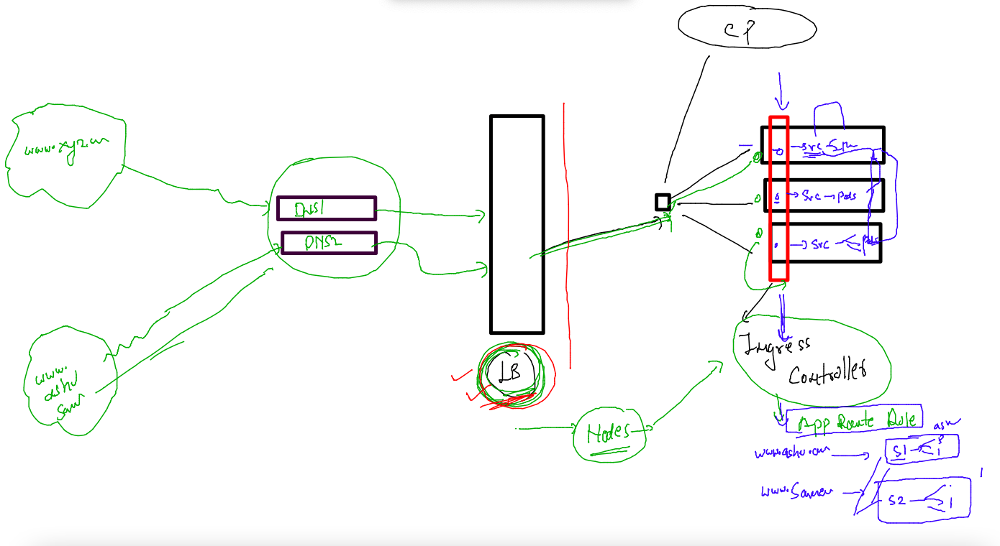

# Training plan 


## ALL Revision 

### setup k8s cluster options 


### a customer story 


## COntainerizing webapps 

### cloning app env 

```
[ashu@docker-ce ashu-images]$ mkdir  ashu-customer
[ashu@docker-ce ashu-images]$ ls
admin.conf    ashu-customer   html-sample-app  javawebapp                python-apps
ashu-compose  deploy-app-k8s  java-app         project-website-template  reactjs
[ashu@docker-ce ashu-images]$ cd  ashu-customer/
[ashu@docker-ce ashu-customer]$ ls
[ashu@docker-ce ashu-customer]$ git clone https://github.com/ShaifArfan/one-page-website-html-css-project.git
Cloning into 'one-page-website-html-css-project'...
remote: Enumerating objects: 52, done.
remote: Total 52 (delta 0), reused 0 (delta 0), pack-reused 52
Receiving objects: 100% (52/52), 347.58 KiB | 1.43 MiB/s, done.
Resolving deltas: 100% (15/15), done.
[ashu@docker-ce ashu-customer]$ git clone https://github.com/microsoft/project-html-website.git
Cloning into 'project-html-website'...
remote: Enumerating objects: 24, done.
remote: Counting objects: 100% (5/5), done.
remote: Compressing objects: 100% (5/5), done.
remote: Total 24 (delta 0), reused 3 (delta 0), pack-reused 19
Receiving objects: 100% (24/24), 465.86 KiB | 15.03 MiB/s, done.
[ashu@docker-ce ashu-customer]$ ls
one-page-website-html-css-project  project-html-website
[ashu@docker-ce ashu-customer]$ 
```

### .dockerignore file 

```
one-page-website-html-css-project/.git
one-page-website-html-css-project/LICENSE
one-page-website-html-css-project/README.md
project-html-website/.git
project-html-website/LICENSE
project-html-website/README.md
project-html-website/SECURITY.md

```

### Dockerfile 

```
FROM oraclelinux:8.4
LABEL name=ashutoshh
LABEL email=ashutoshh@linux.com
ENV APP=web 
# creating an ENV variable with in the image with some default value 
RUN yum install httpd -y && mkdir -p /myapps/{webapp1,webapp2}
COPY project-html-website /myapps/webapp1/
ADD one-page-website-html-css-project  /myapps/webapp2/
COPY deploy.sh /myapps/
WORKDIR /myapps
RUN chmod +x deploy.sh
ENTRYPOINT ["./deploy.sh"]
# while creating container ENTRYPOINT argument is generally not replaceable like cmd
#CMD ["./deploy.sh"]
```

### shell script 

```
#!/bin/bash

if [ "$APP" == "customerapp1" ]
then
    cp -rf  /myapps/webapp1/*  /var/www/html/
    httpd -DFOREGROUND # to start apache httpd service --like systemctl start httpd 
elif [ "$APP" == "customerapp2" ]
then
    cp -rf /myapps/webapp2/*  /var/www/html/
    httpd -DFOREGROUND
else 
    echo "Hello please check your APP variable value " >/var/www/html/index.html
    httpd -DFOREGROUND
fi 
```

### compose file 

```
version: '3.8'
services:
  ashucustomerapp:
    image: docker.io/dockerashu/ashu-customer:appv1 
    build:
      context: .
      dockerfile: Dockerfile
    container_name: ashuc1
    ports:
    - "1234:80"
    environment:
      APP: "customerapp1"
    restart: always 
```

### lets test -

```
ashu@docker-ce ashu-customer]$ docker-compose up -d
[+] Running 0/1
 ⠿ ashucustomerapp Warning                                                                                                2.3s
[+] Building 19.1s (5/11)                                                                                                      
 => [internal] load build definition from Dockerfile                                                                      0.0s
 => => transferring dockerfile: 553B                                                                                      0.0s
 => [internal] load .dockerignore                                                                                         0.0s
 => => transferring context: 285B                                                                                         0.0s
 => [internal] load metadata for docker.io/library/oraclelinux:8.4                                                        0.0s
 => CACHED [1/7] FROM docker.io/library/oraclelinux:8.4                                                                   0.0s
 => [internal] load build context                                                                                         0.1s
 => => transferring context: 1.19MB                                                                                       0.1s
 => [2/7] RUN yum install httpd -y && mkdir -p /myapps/{webapp1,webapp2}                                                 19.0s
 => => # Oracle Linux 8 BaseOS Latest (x86_64)            79 MB/s |  53 MB     00:00                                          

```

### push image to docker hub 

```
ashu@docker-ce ashu-customer]$ docker login -u dockerashu
Password: 
WARNING! Your password will be stored unencrypted in /home/ashu/.docker/config.json.
Configure a credential helper to remove this warning. See
https://docs.docker.com/engine/reference/commandline/login/#credentials-store

Login Succeeded
[ashu@docker-ce ashu-customer]$ docker push docker.io/dockerashu/ashu-customer:appv1
The push refers to repository [docker.io/dockerashu/ashu-customer]
4fd0ab42ab48: Pushed 
5f70bf18a086: Pushed 
89f1aaa629eb: Pushed 
```

### app deploy check in k8s 

```
[ashu@docker-ce deploy-app-k8s]$ ls
ashu-app.yaml  autopod.yaml  db.yaml          mytask.yaml  nodeport1.yaml  secretdb.yaml
auto.json      cm.yaml       deployment.yaml  newsvc.yaml  reajct.yaml
[ashu@docker-ce deploy-app-k8s]$ 
[ashu@docker-ce deploy-app-k8s]$ 
[ashu@docker-ce deploy-app-k8s]$ kubectl   get  nodes
NAME            STATUS   ROLES           AGE   VERSION
control-plane   Ready    control-plane   44d   v1.25.3
worker1         Ready    <none>          44d   v1.25.3
worker2         Ready    <none>          44d   v1.25.3
[ashu@docker-ce deploy-app-k8s]$ kubectl  config get-contexts 
CURRENT   NAME                          CLUSTER      AUTHINFO           NAMESPACE
*         kubernetes-admin@kubernetes   kubernetes   kubernetes-admin   ashu-apps
[ashu@docker-ce deploy-app-k8s]$ kubectl  delete all --all
No resources found
[ashu@docker-ce deploy-app-k8s]$ kubectl   get  pods
No resources found in ashu-apps namespace.
[ashu@docker-ce deploy-app-k8s]$ 

```

## Understanding Ingress controller 



## taking cases 

### app with no ingress 

```
kubectl   create  deployment ashu-final-app --image=docker.io/dockerashu/ashu-customer:appv1    --port 80 --dry-run=client -o yaml >final_deployment.yaml 
```

### updating env section 

```
apiVersion: apps/v1
kind: Deployment
metadata:
  creationTimestamp: null
  labels:
    app: ashu-final-app
  name: ashu-final-app
spec:
  replicas: 1
  selector:
    matchLabels:
      app: ashu-final-app
  strategy: {}
  template: # for pod creation purpose 
    metadata:
      creationTimestamp: null
      labels:
        app: ashu-final-app
    spec:
      containers:
      - image: docker.io/dockerashu/ashu-customer:appv1
        name: ashu-customer
        ports:
        - containerPort: 80
        env: # using env to deploy particular app 
        - name: APP
          value: customerapp1 
        resources: {}
status: {}

```

### deploy it 

```
[ashu@docker-ce deploy-app-k8s]$ kubectl  apply -f final_deployment.yaml 
deployment.apps/ashu-final-app created
[ashu@docker-ce deploy-app-k8s]$ kubectl   get  deployment 
NAME             READY   UP-TO-DATE   AVAILABLE   AGE
ashu-final-app   0/1     1            0           5s
[ashu@docker-ce deploy-app-k8s]$ kubectl   get  deployment 
NAME             READY   UP-TO-DATE   AVAILABLE   AGE
ashu-final-app   1/1     1            1           15s
[ashu@docker-ce deploy-app-k8s]$ kubectl   get  pods
NAME                              READY   STATUS    RESTARTS   AGE
ashu-final-app-7c549848b8-2ts7k   1/1     Running   0          18s
[ashu@docker-ce deploy-app-k8s]$ 

```

### so creating Nodeport or loadbalancer service because we are not having Ingress controller 

```
[ashu@docker-ce deploy-app-k8s]$ kubectl   get  deploy 
NAME             READY   UP-TO-DATE   AVAILABLE   AGE
ashu-final-app   1/1     1            1           4m20s
[ashu@docker-ce deploy-app-k8s]$ kubectl  expose deployment  ashu-final-app  --type  NodePort --port 80 --name ashulb1 --dry-run=client -o yaml >final_np.yaml
[ashu@docker-ce deploy-app-k8s]$ 
[ashu@docker-ce deploy-app-k8s]$ 
[ashu@docker-ce deploy-app-k8s]$ kubectl  expose deployment  ashu-final-app  --type  LoadBalancer --port 80 --name ashulb2 --dry-run=client -o yaml >final_lb.yaml
[ashu@docker-ce deploy-app-k8s]$ kubectl  apply -f final_lb.yaml -f final_np.yaml 
service/ashulb2 created
service/ashulb1 created
[ashu@docker-ce deploy-app-k8s]$ kubectl   get  svc 
NAME      TYPE           CLUSTER-IP       EXTERNAL-IP   PORT(S)        AGE
ashulb1   NodePort       10.99.235.247    <none>        80:32528/TCP   3s
ashulb2   LoadBalancer   10.107.195.190   <pending>     80:30008/TCP   3s
[ashu@docker-ce deploy-app-k8s]$ 
```

### deleting both services 

```
[ashu@docker-ce deploy-app-k8s]$ kubectl  delete svc  ashulb1  ashulb2 
service "ashulb1" deleted
service "ashulb2" deleted
```

## lets take Ingress controller in picture 

### verify Ingress controller in k8s 

```
[ashu@docker-ce ~]$ kubectl   get  ns  |   grep ingress
ingress-nginx          Active   21d
[ashu@docker-ce ~]$ 
[ashu@docker-ce ~]$ 
[ashu@docker-ce ~]$ kubectl   get  po -n ingress-nginx 
NAME                                        READY   STATUS    RESTARTS         AGE
ingress-nginx-controller-6c56945c75-bzrwl   1/1     Running   10 (3h21m ago)   20d
[ashu@docker-ce ~]$ kubectl   get svc  -n ingress-nginx 
NAME                                 TYPE        CLUSTER-IP       EXTERNAL-IP   PORT(S)                      AGE
ingress-nginx-controller             NodePort    10.109.170.190   <none>        80:31782/TCP,443:32292/TCP   21d
ingress-nginx-controller-admission   ClusterIP   10.97.103.129    <none>        443/TCP                      21d
[ashu@docker-ce ~]$ 
```

### lets create clusterIP type service 

```
ashu@docker-ce deploy-app-k8s]$ kubectl   expose deployment ashu-final-app  --type  ClusterIP --port 80 --name ashu-final-lb3 --dry-run=client -o yaml >final_lb3.yaml
[ashu@docker-ce deploy-app-k8s]$ kubectl  apply -f final_lb3.yaml 
service/ashu-final-lb3 created
[ashu@docker-ce deploy-app-k8s]$ kubectl   get  svc
NAME             TYPE        CLUSTER-IP      EXTERNAL-IP   PORT(S)   AGE
ashu-final-lb3   ClusterIP   10.108.208.90   <none>        80/TCP    2s
[ashu@docker-ce deploy-app-k8s]$ 
[ashu@docker-ce deploy-app-k8s]$ 
```


### with Ingress deploy app 


### Ingress rule 

```
apiVersion: networking.k8s.io/v1
kind: Ingress
metadata:
  name: ashu-app-route # name of my app routing rule 
  annotations:
    nginx.ingress.kubernetes.io/rewrite-target: /
spec:
  ingressClassName: nginx # className means which product u r using to implement ingress 
  rules:
  - host: me.ashutoshh.in # the domain name of app which people will use to access 
    http:
      paths:
      - path: / # on homepage to app 
        pathType: Prefix
        backend:
          service:
            name: ashu-final-lb3 # service name where ingress will forward traffic 
            port:
              number: 80 # port of service 
```

### lets deploy it 

```
[ashu@docker-ce deploy-app-k8s]$ kubectl apply -f ashu-ingress-rule.yaml 
ingress.networking.k8s.io/ashu-app-route created
[ashu@docker-ce deploy-app-k8s]$ kubectl   get  ingress
NAME             CLASS   HOSTS             ADDRESS         PORTS   AGE
ashu-app-route   nginx   me.ashutoshh.in   172.31.39.221   80      4s
[ashu@docker-ce deploy-app-k8s]$ 
```


